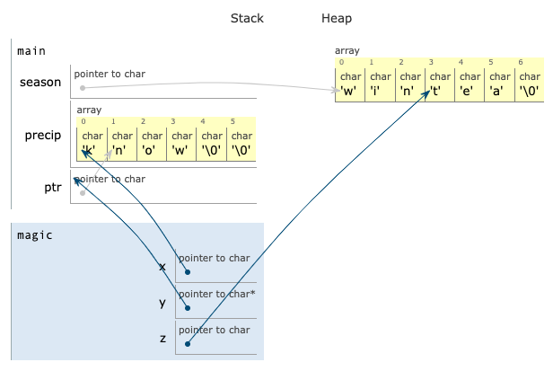

# Virtualization: cloud computing; Exam 3 review
_COSC 208, Introduction to Computer Systems, 2023-05-05_

## Announcements
* Final exam
    * Study guide posted on Moodle
    * Take-home portion: posted on Moodle; due Tuesday
    * In-class portion: Tuesday 9am-11am or 12pm-2pm

## Outline
* Cloud computing
* Review

## No warm-up – Happy last day of classes!

## Cloud computing

* Characteristics
    * Resources available on-demand — tenants reserve resources only when they need them
        * E.g., a company uses more virtual machines during the day when employees are using applications
        * E.g., a website has more visitors during a sale or popular event
    * Pay-per-use — only pay for the resources you use
        * E.g., pay for a virtual machine per hour of use
        * E.g., pay for storage per GB per month
    * Shared & virtualized — physical servers and storage devices resources are used by multiple tenants
        * E.g., multiple virtual machines run on the same machine
        * Physical servers and storage are usually more isolated than network switches and links
* Service models
    * Infrastructure-as-a-Service (IaaS)
        * Tenants lease virtual machines, virtual storage, and virtual networks
        * Tenants must manage the operating system, file system, etc.
        * E.g., Amazon EC2, Microsoft Azure, Rackspace, Google Compute Engine
    * Platform-as-a-Service (PaaS)
        * Tenants lease resources to run applications written in a specific language — Python, Java, Hadoop/MapReduce
        * Cloud provider manages the operating system, file system, and network
        * E.g., Google App Engine, Cloud Foundry, IBM Cloud
    * Function-as-a-Service (FaaS) or serverless
        * Tenants run independent snippets of code
        * E.g., Amazon Lambda
    * Software-as-a-Service (SaaS)
        * Tenants lease access to specific software
        * E.g., Salesforce, Concur, Constant Contact, Google Drive, Office 365
    * Storage-as-a-Service (STaaS)
        * E.g., Dropbox, Google Drive, iCloud
    * Ownership
        * Public - anyone can request and use resources
        * Private - resources are only available to tenants (e.g., departments) within a company or organization
        * Hybrid - tenants use a combination of public and private cloud resources

_For each of the following service providers, indicate what type of service they offer._

* Q1: _Box provides secure file sharing and storage_

    Storage-as-a-Service (STaaS)

* Q2: _Microsoft Azure provides virtual machines running Windows or Linux_

    Infrastructure-as-a-Service (IaaS)

* Q3: _Heroku allows tenants to deploy code written in Ruby, Java, PHP, Python, Go, Scala, or Clojure_

    Platform-as-a-Service (PaaS)

* Q4: _Oracle Supply Chain Management (SCM) is software that allows businesses to manage their supply chain_

    Software-as-a-Service (SaaS)

## Review

### Virtual machines and containers

* Q5: _What is an advantage of using **virtual machines with a type 1 hypervisor** instead of **virtual machines with a type 2 hypervisor**?_

    With a type 1 hypervisor, system calls issued by processes only need to be handled by the hypervisor and guest operating system, whereas with a type 2 hypervisor, system calls issued by processes need to be handled by the host operating system, hypervisor, and guest operating system. Thus, a type 1 hypervisor adds less overhead and results in better performance.

* Q6: _What is an advantage of using **virtual machines with a type 2 hypervisor** instead of **virtual machines with a type 1 hypervisor**?_

    A type 2 hypervisor can be installed atop an existing (host) operating system just like any other application, whereas a type 1 hypervisor needs to be installed directly atop the hardware before any operating systems are installed. Thus, a type 2 hypervisor is easier to set up.

* Q7: _What is an advantage of using **containers** instead of **virtual machines with a type 1 hypervisor**?_

    With containers, all processes run atop a single operating system instances, whereas with a type 1 hypervisor, each group of processes requires a separate operating system. Thus, containers avoid the need to maintain multiple copies of the same operating system.

    With containers, systems calls issued by processes only need to be handled by the operating system, just like a system without containers or virtual machines, whereas with a type 1 hypervisor, system calls issued by processes need to be handled by the hypervisor and the operating system running inside the virtual machine. Thus, containers add less overhead and result in better performance.

* Q8: _What is an advantage of using **virtual machines with a type 1 hypervisor** instead of **containers**?_

    With a type 1 hypervisor, multiple flavors (e.g., Windows, Linux, Mac OS) and/or versions (e.g., Windows 8, Windows 10) of operating systems can run atop the same physical hardware, whereas with containers only a single operating system can run atop the hardware. Thus, type 1 hypervisors allow multiple OSes to be run on the same computer system.

### Threads

A program contains the following global variables and functions:
```C
void *dbl(void *arg) {
    int *t = (int *)arg;
    *t = *t * 2;
}

void *inc(void *arg) {
    int *t = (int *)arg;
    *t = *t + 1;
}
```
_For each of the following main methods, list **all possible outputs** the program could produce. Assume threads are only preempted if they become blocked waiting for other threads._


```c
// Q9
int main() {
    int *total = malloc(sizeof(int));
    *total = 3;
    pthread_t thrA, thrB;
    pthread_create(&thrA, NULL, &dbl, total);
    pthread_create(&thrB, NULL, &inc, total);
    pthread_join(thrA, NULL);
    pthread_join(thrB, NULL);
    printf("%d\n", total);
}
```

* `7` (if `thrB` runs after `thrA` finishes)
* `8` (if `thrA` runs after `thrB` finishes)


```c
// Q10
int main() {
    int *total = malloc(sizeof(int));
    *total = 3
    pthread_t thrA, thrB;
    pthread_create(&thrA, NULL, &inc, total);
    pthread_join(thrA, NULL);
    pthread_create(&thrB, NULL, &dbl, total);
    pthread_join(thrB, NULL);
    printf("%d\n", total);
}
```

* `8` (`thrA` is joined, i.e., must finish, before `thrB` is created) 

### Scheduling

_Consider the following set of processes:_

| Process | Duration | Arrival Time |
|---------|----------|--------------|
| A       | 20       | 0            |
| B       | 15       | 0            |
| C       | 25       | 5            |
| D       | 5        | 10           |

* Q11: _Draw the schedule when a First In First Out (FIFO) scheduling algorithm is used._

```
  A                   B              C                        D
|-------------------|--------------|------------------------|----|
0                   20             35                       60   65
```

* Q12: _Compute the turnaround and wait time for each process based on the above schedule._

| Process | Turnaround | Wait |
|---------|------------|------|
| A       | 20         | 0    |
| B       | 35         | 20   |
| C       | 55         | 30   |
| D       | 55         | 50   |

* Q13: _Draw the schedule when a Shortest Job First (SJF) scheduling algorithm is used._

```
  B              D    A                   C
|--------------|----|-------------------|------------------------|
0              15   20                  40                       65
```

* Q14: _Compute the turnaround and wait time for each process based on the above schedule._

| Process | Turnaround | Wait |
|---------|------------|------|
| A       | 40         | 20   |
| B       | 15         | 0    |
| C       | 60         | 35   |
| D       | 10         | 5    |

* Q15: _Draw the schedule when a Shortest Time to Completion First (STCF) scheduling algorithm is used._

```
  B              D    A                   C
|--------------|----|-------------------|------------------------|
0              15   20                  40                       65
```

* Q16: _Compute the turnaround and wait time for each process based on the above schedule._

| Process | Turnaround | Wait |
|---------|------------|------|
| A       | 40         | 20   |
| B       | 15         | 0    |
| C       | 60         | 35   |
| D       | 10         | 5    |

* Q17: _Draw the schedule when a Round Round (RR) scheduling algorithm is used with a time quantum of 10._

```
  A         B         C         D   A          B    C
|---------|---------|---------|----|---------|----|-------------------|
0         10        20        30   35        45   50                  65
```

* Q18: _Compute the turnaround and wait time for each process based on the above schedule._

| Process | Turnaround | Wait |
|---------|------------|------|
| A       | 45         | 25   |
| B       | 50         | 35   |
| C       | 60         | 35   |
| D       | 25         | 20   |

### Processes

* Q19: _Write a program that creates a new process. The child process should print "I am a child"; the parent process should print "I am a parent; my child is CPID" (replacing CPID with the child’s PID)._


```c
#include <stdio.h>
#include <unistd.h>
int main() {
    int pid = fork();
    if (pid == 0) {
        printf("I am a child\n");
    }
    else {
        printf("I am a parent; my child is %d\n", pid);
    }
}
```

    I am a parent; my child is 1375
    I am a child


* Q20: _Will the output produced by your program always appear in a particular order? Why or why not?_

* No, because the parent does not `wait` for the child to finish before printing, and the OS scheduler determines which order the processes run
* If you included a call to `wait` before the call to `printf` in the else body, then the answer would be yes, because the parent waits for the child to finish before printing

* Q21: _Write a program that creates two new processes. The first process should run the executable `/usr/bin/whoami`. The second process should print `I have a sibling` after the first process has finished._


```c
#include <stdio.h>
#include <unistd.h>
#include <sys/wait.h>
int main() {
    int retval = fork();
    if (retval == 0) {
        char *cmd[] = { "/usr/bin/whoami", NULL };
        execv(cmd[0], cmd);
    } else {
        wait(NULL); 
    }

    retval = fork();
    if (retval == 0) {
        printf("I have a sibling\n");
        return 0;
    } else {
        return 0;
    }
}
```

    aaron
    I have a sibling


* Q22: _What are all possible outputs the following program may produce?_


```c
#include <stdio.h>
#include <unistd.h>
int main() {
    printf("A\n");
    int retval = fork();
    printf("B\n");
    if (retval == 0) {
        printf("C\n");
    }
    else {
        printf("D\n");
    }
}
```

```
A
B
C
B
D
```
OR
```
A
B
B
C
D
```
OR
```
A
B
D
B
C
```
OR
```
A
B
B
D
C
```

### Loop optimization

* Q23: _Modify the following code to perform all relevant loop optimizations. You should assume the length of the key is **significantly smaller** than the length of the plain string, such that the entire key will fit in the cache but the entire plain string will not fit in the cache._


```c
char *vigenere(char *plain, char *key, int keylen) {
    char *cipher = malloc(sizeof(char) * (strlen(plain) + 1));
    cipher[strlen(plain)] = '\0';
    int j = 0;
    while (j < keylen) {
        int i = j;
        while (i < strlen(plain)) {
            cipher[i] = (((plain[i] - 'A') + key[j]) % 26) + 'A';
            i += keylen;
        }
        j++;
    }
    return cipher;
}
```

Optimizations: loop-invariant code motion to call `strlen` only once; loop interchange to avoid "jumping around" the `plain` array (there is now "jumping around" the key array, but this is tolerable because the key is small enough to fit entirely in the cache)


```c
char *vigenere(char *plain, char *key, int keylen) {
    int len = strlen(plain);
    char *cipher = malloc(sizeof(char) * (len + 1));
    cipher[len] = '\0';
    int i = 0;
    while (i < len) {
        int j = 0;
        while (j < keylen && i < len) {
            cipher[i] = (((plain[i] - 'A') + key[j]) % 26) + 'A';
            j++;
            i++;
        }
    }
    return cipher;
}
```

Alternative code with same optimizations


```c
char *vigenere(char *plain, char *key, int keylen) {
    int len = strlen(plain);
    char *cipher = malloc(sizeof(char) * (len + 1));
    cipher[len] = '\0';
    int i = 0;
    while (i < len) {
        int j = 0;
        while (j < keylen && i+j < len) {
            cipher[i+j] = (((plain[i+j] - 'A') + key[j]) % 26) + 'A';
            j++;
        }
        i += keylen;
    }
    return cipher;
}
```

### Caching

* Q24: _Assume the cache size is 3 and the **optimal** cache replacement algorithm is used. Indicate what happens with the cache on each data access._

* Access 2
* Access 4
* Access 1
* Access 2
* Access 4
* Access 3
* Access 2
* Access 4
* Access 1
* Access 2
* Access 4
* Access 1

<p style="height:1em;"></p>

    * Access 2 — +2
    * Access 4 — +4
    * Access 1 — +1
    * Access 2 — Hit
    * Access 4 — Hit
    * Access 3 — -1/+3
    * Access 2 — Hit
    * Access 4 — Hit
    * Access 1 — -3/+1
    * Access 2 — Hit
    * Access 4 — Hit
    * Access 1 — Hit

* Q25: _Assume the cache size is 3 and the **least recently used (LRU)** cache replacement algorithm is used. Indicate what happens with the cache on each data access._

* Access 2
* Access 4
* Access 1
* Access 2
* Access 4
* Access 3
* Access 2
* Access 4
* Access 1
* Access 2
* Access 4
* Access 1

<p style="height:1em;"></p>

    * Access 2 — +2
    * Access 4 — +4
    * Access 1 — +1
    * Access 2 — Hit
    * Access 4 — Hit
    * Access 3 — -1/+3
    * Access 2 — Hit
    * Access 4 — Hit
    * Access 1 — -3/+1
    * Access 2 — Hit
    * Access 4 — Hit
    * Access 1 — Hit

### Reducing memory accesses

* Q26: _Cross-out unnecessary loads and stores for the following assembly code:_

```
000000000000076c <divide>:                      
    76c:    d10083ff     sub    sp, sp, #0x20   
    770:    b9000fe0     str    w0, [sp, #12]
    774:    b9000be1     str    w1, [sp, #8]        XXXX
    778:    12800000     mov    w0, #0xffffffff     
    77c:    b9001fe0     str    w0, [sp, #28]       XXXX
    780:    b9400fe1     ldr    w1, [sp, #8]        XXXX
    784:    b9400be0     ldr    w0, [sp, #12]
    788:    1ac00c20     sdiv   w0, w1, w0      
    78c:    b9001fe0     str    w0, [sp, #28]       XXXX
    790:    b9401fe0     ldr    w0, [sp, #28]       XXXX
    794:    910083ff     add    sp, sp, #0x20   
    798:    d65f03c0     ret                    
```

* Q27: _Cross-out unnecessary loads and stores for the following assembly code:_

```
000000000000071c <flip>:
    71c:    d10083ff     sub    sp, sp, #0x20
    720:    b9000fe0     str    w0, [sp, #12]   XXXX
    724:    12800000     mov    w1, #0xffffffff
    728:    b9001fe0     str    w1, [sp, #28]
    72c:    b9400fe0     ldr    w0, [sp, #12]   XXXX
    730:    7100001f     cmp    w0, #0x0
    734:    54000081     b.eq   740 <flip+0x28>
    738:    b9001fff     str    wzr, [sp, #28]
    73c:    14000002     b      748 <flip+0x2c>
    740:    52800020     mov    w0, #0x1
    744:    b9001fe0     str    w0, [sp, #28]
    748:    b9401fe0     ldr    w0, [sp, #28]
    74c:    910083ff     add    sp, sp, #0x20
    750:    d65f03c0     ret    
```

### Memory hierarchy

* Q28: _What is the **fastest volatile** memory?_

    registers

* Q29: _What is the **fastest non-volatile** memory?_

    solid state drive (SSD) or SDcard

* Q30: _Why is a hard disk drive (HDD) slower than a solid state drive (SSD)?_

an HDD has moving parts that need to be moved into position before data can be read/written    solid state drive (SSD) or SDcard

* Q31: _Why is accessing main memory (i.e., Random Access Memory (RAM)) slower than accessing a cache?_

a cache is part of the CPU, but data needs to travel across a bus to move between the CPU and main memory; the memory circuits used in RAM are slower than the memory circuits used in a cache

### Memory errors

The intended behavior of the program below is to output a string that contains multiple copies of a word (e.g., `"byebye"`). The code below compiles without warnings, but it contains multiple errors.


```c
/*1 */  #include <stdlib.h>
/*2 */  #include <string.h>
/*3 */  #include <stdio.h>
/*4 */  char *repeat(char *word, int count) {
/*5 */      char *dup = malloc(sizeof(*word) * count + 1);
/*6 */      int k = 0;
/*7 */      for (int i = 0; i < count; i++) {
/*8 */          for (int j = 0; j <= strlen(word) * count; j++) {
/*9 */              dup[k] = word[j];
/*10*/              k++;
/*11*/          }
/*12*/      }
/*13*/      free(dup);
/*14*/      return dup;
/*15*/  }
/*16*/  int main() {
/*17*/      char *orig = malloc(4);
/*18*/      strcpy(orig, "bye");
/*19*/      char *result = repeat(orig, 2);
/*20*/      printf("%s\n", result);
/*21*/  }
```

_For each of the following errors produced by valgrind, describe (in 2-3 sentences) **why** the error is occurring and **how** you would modify the code to correct the error._

* Q32:
    ```
    Invalid write of size 1
        at 0x4006CA: repeat (repeat.c:9)
        by 0x400752: main (repeat.c:19)
    Address 0x5204093 is 0 bytes after a block of size 3 alloc'd
        at 0x4C2DB8F: malloc (in vgpreload_memcheck-amd64-linux.so)
        by 0x40066B: repeat (repeat.c:5)
        by 0x400752: main (repeat.c:19)
    ```

Not enough space was allocated for the duplicated string: `sizeof(*word)` gets the size of a single character. Use `strlen(word)` to get the number of characters in the original word.

* Q33:
    ```
    Invalid read of size 1
        at 0x4006BF: repeat (repeat.c:9)
        by 0x400752: main (repeat.c:19)
    Address 0x5204044 is 0 bytes after a block of size 4 alloc'd
        at 0x4C2DB8F: malloc (in vgpreload_memcheck-amd64-linux.so)
        by 0x400723: main (repeat.c:17)
    ```

The inner for loop goes beyond the end of the original word. The for loop condition should be `j < strlen(word)`.

* Q34:
    ```
    Invalid read of size 1
        at 0x4E88CD0: vfprintf (vfprintf.c:1632)
        by 0x4E8F8A8: printf (printf.c:33)
        by 0x40076B: main (repeat.c:20)
    Address 0x5204090 is 0 bytes inside a block of size 3 free'd
        at 0x4C2EDEB: free (in vgpreload_memcheck-amd64-linux.so)
        by 0x4006FF: repeat (repeat.c:13)
        by 0x400752: main (repeat.c:19)
    Block was alloc'd at
        at 0x4C2DB8F: malloc (in vgpreload_memcheck-amd64-linux.so)
        by 0x40066B: repeat (repeat.c:5)
        by 0x400752: main (repeat.c:19)
    ```

The string containing the repeated word is free'd (in `repeat`) before it is printed (in `main`). Move the call to `free` in `repeat` to after the call to `printf` in `main`.

* Q35:
    ```
    4 bytes in 1 blocks are definitely lost in loss record 1 of 1
        at 0x4C2DB8F: malloc (in vgpreload_memcheck-amd64-linux.so)
        by 0x400723: main (repeat.c:17)
    ```

The space for the original word (allocated in `main`) is not freed. Add `free(orig)` after the call to `repeat` in `main`.

### Pointers & dynamic memory allocation

* Q36: _Assume the following program is executed._


```c
#include <stdlib.h>
#include <string.h>
void magic(char *x, char **y) {
    char *z = *y;
    z[2] = 'a';
    *x = 'k';
    *y = &x[1];
    // STOP HERE
}

int main() {
    char *season = malloc(sizeof(char) * 7);
    strcpy(season, "winter");
    char precip[6] = "snow";
    char *ptr = season + 3;
    magic(precip, &ptr);
}
```

_Draw the contents of the stack and heap when the program reaches the comment `STOP HERE`. If a memory region is freed, cross it out; do not erase it from your diagram._



### Number representation

* Q37: _Convert `0b10101010` to an unsigned decimal number_

    170

* Q38: _Convert `0b10101010` to an signed decimal number_

    -86

* Q39: _Convert `43` to 8-bit two's complement_

    0b00101011

* Q40: _Convert `-43` to 8-bit two's complement_

    0b11010101

* Q41: _Compute `(0b1100 ^ 0b1111) & 0b0101`_

    0b0001

* Q42: _Compute `(~0b1100) | 0b0101`_

    0b0111

* Q43: _In a system that represents numbers using 8-bit two's complement will the computation `120 + 16` result in overflow, underflow, or neither?_

    overflow

* Q44: _In a system that represents numbers using 8-bit two's complement will the computation `-120 + -8` result in overflow, underflow, or neither?_

    neither
