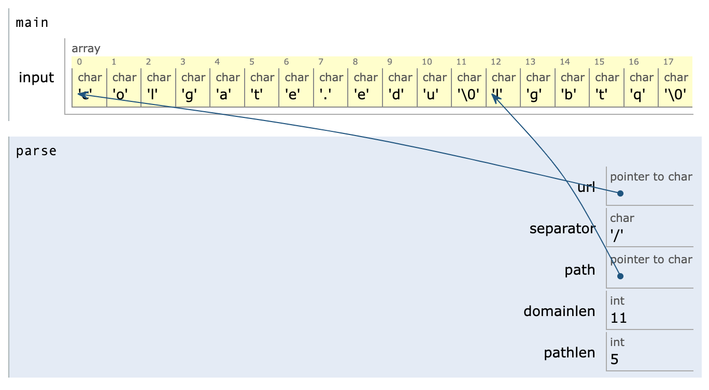

# Program memory: arrays & pointers
_COSC 208, Introduction to Computer Systems, 2023-09-15_

## Announcements
* Project 1 due Thurs, Sept 21 @ 11pm

## Outline
* Warm-up
* Arrays & pointers

## Warm-up

* Q1: _What does the following program output?_


```c
#include <stdio.h>
void copy1(int a, int b) {
    a = b;
}
void copy2(int *c, int *d) {
    c = d;
}
void copy3(int *e, int *f) {
    *e = *f;
}
int main() {
    int q = 1;
    int r = 2;
    copy1(q, r);
    printf("%d %d\n", q, r);
    int s = 3;
    int t = 4;
    copy2(&s, &t);
    printf("%d %d\n", s, t);
    int u = 5;
    int v = 6;
    copy3(&u, &v);
    printf("%d %d\n", u, v);
}
```

    1 2
    3 4
    6 6


* Q2: _Write a function called `add` which takes an integer (`num`) and an integer pointer (`ptr`) and adds `num` to the value `ptr` points to._
    
    _Also write a `main` function which:_
    1. _Stores `20` in a variable_
    2. _Calls `add` with the number `5` and a pointer to the aforementioned variable_
    3. _Prints the value stored in the variable after `add` returns_


```c
#include <stdio.h>
void add(int num, int *ptr) {
    *ptr = *ptr + num;
}
int main() {
    int x = 20;
    add(5, &x);
    printf("%d\n", x);
}
```

    25


* Q3: _What does the following program output?_


```c
#include <stdio.h>
int main() {
    char s = 'S';
    char *t = &s;
    int u = 3;
    int *v = &u;
    int *w = v;
    printf("%c %c %d %d %d\n", s, *t, u, *v, *w);
    *t = 'B';
    u = 2;
    printf("%c %c %d %d %d\n", s, *t, u, *v, *w);
    s = s + *v;
    printf("%c %c %d %d %d\n", s, *t, u, *v, *w);
}
```

    S S 3 3 3
    B B 2 2 2
    D D 2 2 2


## Arrays & pointers

* An array variable is a constant (`const`) pointer to a region of memory where the items in the array are stored

* Example


```c
#include <stdio.h>
int main() {
    char word[] = "hat";
    printf("word = %s\n", word);
    char *ptr = word;
    printf("ptr = %s\n", ptr);
    if (ptr == word) {
        printf("ptr == word\n");
    }
    else {
        printf("ptr != word\n");
    }
    word[1] = 'i';
    printf("word = %s\n", word);
    *ptr = 's';
    printf("word = %s\n", word);
    ptr = &word[1];
    printf("ptr = %s\n", ptr);
    ptr[0] = 'a';
    printf("word = %s\n", word);
}
```

    word = hat
    ptr = hat
    ptr == word
    word = hit
    word = sit
    ptr = it
    word = sat


* This explains why there is no out-of-bounds checks for arrays: the memory addresses in pointers are never checked to see if they are valid
* This also explains why you can change an array within a function and have those changes reflected outside of the function

* Example: array as a parameter


```c
#include <stdio.h>
void update(char str[]) {
    str[0] = 'p';
}
int main() {
    char word[] = "mat";
    printf("%s\n", word);
    update(word);
    printf("%s\n", word);
}
```

    mat
    pat


* Q4: _What does the following program output?_


```c
#include <stdio.h>
void mystery(int arr[]) {
    *arr = *arr * 5;
    arr[1] = arr[1] * 10;
}

int main() {
    int nums[] = {1, 2, 3, 4};
    printf("%d %d\n", *nums, nums[1]);
    int *ptr = &nums[1];
    printf("%d %d\n", *ptr, ptr[1]);
    mystery(nums);
    printf("%d %d\n", *nums, nums[1]);
    printf("%d %d\n", *ptr, ptr[1]);
}
```

_Postponed to next class_

* Q5: _Write a function called `underscore` which takes an array of characters and replaces all spaces with underscores. Also write a `main` function that:_
    1. _Stores the string `"This has spaces"` in an array of characters_
    2. _Calls the `underscore` function on the array_
    3. _Prints the string after `underscore` returns_

_Postponed to next class_

## ⭐ Extra practice
* Q6: _What does the following program output?_


```c
#include <stdio.h>
void increment1(int a) {
    a = a + 1;
}
void increment2(int *b) {
    *b = *b + 1;
}
int main() {
    int x = 1;
    int *y = &x;
    increment1(x);
    printf("%d %d\n", x, *y);
    increment2(y);
    printf("%d %d\n", x, *y);
}
```

    1 1
    2 2


* Q7: _What does the following program output?_


```c
#include <stdio.h>
void swap1(char *c, char *d) {
    char *tmp = c;
    c = d;
    d = tmp;
}
void swap2(char *a, char *b) {
    char tmp = *a;
    *a = *b;
    *b = tmp;
}
int main() {
    char q = 'Q';
    char r = 'R';
    swap1(&q, &r);
    printf("%c %c\n", q, r);
    char s = 'S';
    char t = 'T';
    swap2(&s, &t);
    printf("%c %c\n", s, t);
}
```

    Q R
    T S


* Q8: _Write a program that:_
    1. _Stores 5 in a variable, and stores 10 in another variable_
    2. _Creates and uses pointers to print each number_
    3. _Uses the pointers to add the numbers together and store the result in a new variable_
    4. _Repurposes one of the existing pointers to print the aforementioned result_


```c
#include <stdio.h>
int main() {
    int i = 5;
    int j = 10;
    int *p = &i;
    int *q = &j;
    int k = *p + *q;
    p = &k;
    printf("%d\n", *p);
}
```

    15


* Q9: _Write a function called `transfer` which takes an integer (`amount`) and two integer pointers (`from` and `to`) and moves the specified `amount` from one integer to the other._
    _Also write a `main` function that:_
    1. _Stores `50` in one variable and `100` in another variable_
    2. _Calls `transfer` with the amount `25` and pointers to the aforementioned variable_
    3. _Prints the value stored in the variables after `transfer` returns_


```c
#include <stdio.h>
void transfer(int amount, int *from, int *to) {
    *from = *from - amount;
    *to = *to + amount;
}
int main() {
    int x = 50;
    int y = 100;
    transfer(25, &x, &y);
    printf("%d %d\n", x, y);
}
```

    25 125


* Q10: _Draw a memory diagram that displays the program's variables and their values when the program reaches the comment `STOP HERE`._


```c
#include <stdio.h>
#include <string.h>
char *split(char *str, char delim) {
    for (int i = 0; i < strlen(str); i++) {
        if (str[i] == delim) {
            str[i] = '\0';
            return &str[i+1];
        }
    }
    return NULL;
}

void parse(char *url) {
    char separator = '/';
    char *path = split(url, separator);
    int domainlen = strlen(url);
    int pathlen = strlen(path);
    // STOP HERE
    printf("Domain (%d chars): %s\n", domainlen, url);
    printf("Path (%d chars): %s\n", pathlen, path);
}

int main() {
    char input[] = "colgate.edu/lgbtq";
    parse(input);
}
```

    Domain (11 chars): colgate.edu
    Path (5 chars): lgbtq



