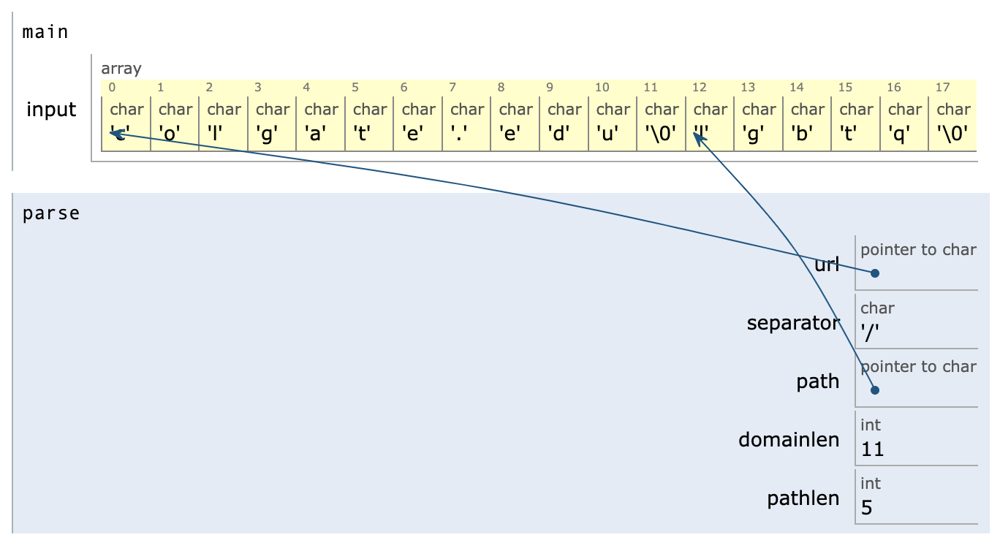

# Program memory: pointer arithmetic; pointers as return values
_COSC 208, Introduction to Computer Systems, 2023-09-18_

## Announcements
* Project 1 due Thurs @ 11pm

    You **may not share or copy code/answers from other students.** Violations of this policy will be considered facilitating academic misconduct and/or cheating according to Colgate’s academic honor code.
    
    Additionally, you **must clearly indicate if any code is copied from or inspired by external sources** (e.g., Stack Overflow, ChatGPT, GitHub Copilot) and adhere to the licensing requirements of such code. Violations of this policy will be considered cheating or plagiarism according to Colgate’s academic honor code. Note that question and answer forums (e.g., Stack Overflow) are often unreliable, and AI-based tools (e.g., ChatGPT) have significant limitations and legal complications.
    
    **If you are struggling to complete an activity—due to a lack of understanding, time pressure, personal matters, etc.—please contact me. I want you to succeed, and I will do everything I can to help you.** Violating the academic honesty expectations for the course (almost) always leads to a bad experience for you and me. If you are unsure what constitutes academic misconduct, please contact me as soon as possible.
    
* Exam 1 next Wednesday 6:30pm-8:30pm

## Outline
* Warm-up
* Pointer arithmetic
* Pointers as return values
* Program memory
* malloc

## Warm-up

* Q1: _What does the following program output?_


```c
#include <stdio.h>
void mystery(int arr[]) {
    *arr = *arr * 5;
    arr[1] = arr[1] * 10;
}

int main() {
    int nums[] = {1, 2, 3, 4};
    printf("%d %d\n", *nums, nums[1]);
    int *ptr = &nums[1];
    printf("%d %d\n", *ptr, ptr[1]);
    mystery(nums);
    printf("%d %d\n", *nums, nums[1]);
    printf("%d %d\n", *ptr, ptr[1]);
}
```

    1 2
    2 3
    5 20
    20 3


* Q2: _Write a function called `underscore` which takes an array of characters and replaces all spaces with underscores. Also write a `main` function that:_
    1. _Stores the string `"This has spaces"` in an array of characters_
    2. _Calls the `underscore` function on the array_
    3. _Prints the string after `underscore` returns_


```c
#include <stdio.h>
#include <string.h>
void underscore(char *str) {
    for (int i = 0; i < strlen(str); i++) {
        if (str[i] == ' ') {
            str[i] = '_';
        }
    }
}
int main() {
    char phrase[] = "This has spaces";
    underscore(phrase);
    printf("%s\n", phrase);
}
```

    This_has_spaces


## Pointer arithmetic

* Adding `n` to a pointer without dereferencing determines the address of the element `n` indices away
* Pointer does not change, unless the new address is assigned to the pointer

* Example


```c
#include <stdio.h>
int main() {
    int nums[] = {2,4,8,16,32,64,128};
    
    int *ptr = nums + 2;
    printf("%d %d\n", *ptr, *nums);
    ptr = ptr + 2;
    printf("%d %d\n", *ptr, *nums);
    // nums = nums + 2; // Not allowed; array variable must point to 0th element
    
    int val = *(nums + 2);
    printf("%d %d\n", val, *nums);
    val = *(ptr + 2);
    printf("%d %d\n", val, *ptr);
    
    nums[2] = 0;
    printf("%d %d\n", *nums, nums[2]);
    *(nums + 2) = -1;
    printf("%d %d\n", *nums, nums[2]);
}
```

    8 2
    32 2
    8 2
    128 32
    2 0
    2 -1


* Q3: _What does the following program output?_


```c
#include <stdio.h>
int main() {
    char phrase[] = "the cat sits";
    char *mysteryA = phrase + 4;
    char *mysteryB = mysteryA + 4;
    printf("%c%c\n", *mysteryA, *mysteryB);
    *(mysteryA + 2) = 'p';
    *mysteryB = 'f';
    printf("%s\n", phrase);
    mysteryA--;
    mysteryB += 2;
    *mysteryB = 'n';
    printf("red%s\n", mysteryA);
}
```

    cs
    the cap fits
    red cap fins


* Q4: _Write a function called `sum` which takes an array of integers and a length and returns the sum of the numbers. The function **must** use a pointer to iterate over the array._


```c
#include <stdio.h>
int sum(int *nums, int len) {
    int *curr = nums;
    int total = 0;
    for (int i = 0; i < len; i++) {
        total += *curr;
        curr++;
    }
    return total;
}
int main() {
    int nums[] = {1, 2, 4, 8};
    printf("%d\n", sum(nums, 4));
}
```

    15


## Pointers as return values
* _What happens?_


```c
#include <stdio.h>
int *one() {
    int x = 1;
    int *p = &x;
    return p;
}
int main() {
    int *q = one();
    printf("%d\n", *q);
}
```

    1


* `q` points to a variable that no longer exists!
* _So, how can I return a pointer from a function?_ — dynamically allocate memory on the heap!

## Program memory
* Memory layout
    ```
    ┏━━━━━━━━━━━━━━━━━━┓ 0
    ┃ Operating system ┃
    ┣━━━━━━━━━━━━━━━━━━┫
    ┃       Code       ┃ <- Function instructions
    ┣━━━━━━━━━━━━━━━━━━┫
    ┃       Data       ┃ <- Global variables
    ┣━━━━━━━━━━━━━━━━━━┫
    ┃       Heap       ┃ <- Dyanmically allocated memory
    ┃         ▼        ┃    Grows toward higher memory addresses
    ┣━━━━━━━━━━━━━━━━━━┫    
    ┃                  ┃
    ┣━━━━━━━━━━━━━━━━━━┫ 
    ┃         ▲        ┃    Grows toward lower memory addresses
    ┃       Stack      ┃ <- Local variables and parameters
    ┗━━━━━━━━━━━━━━━━━━┛ Max address
    ```
    * Stack consists of stack frames --- add a frame when a function is called, remove a frame when a function returns
* Variable storage
    * Local variables and parameters and stored on the stack --- in the frame for the function in which they are declared
    * Global variables are stored in the data section
* Memory allocation
    * Code and data — automatically allocated with a program starts
    * Stack — automatically allocated when a function is called; automatically deallocated when a function returns
    * Heap memory — explicitly allocated and freed by a program

## ⭐ Extra practice

* Q6: _What is the output of this program?_


```c
#include <stdio.h>
int main() {
    int nums[4] = {1,2,3,4};
    printf("%d %d\n", *nums, nums[1]);
    int *ptr = &nums[1];
    nums[1] += 4;
    printf("%d %d\n", *ptr, nums[0]);
    ptr = (nums + 2);
    printf("%d\n", *ptr);
    ptr++; // num++ is illegal
    printf("%d\n", *ptr);
}
```

    1 2
    6 1
    3
    4


* Q7: _What is the output of this program?_


```c
#include <stdio.h>
int main() {
    char *first = "Colgate";
    char second[10] = "Univ";
    char *f = &first[3];
    printf("%d\n", strlen(f));
    char *s = second;
    *s = 'K';
    s++;
    *(s+2) = 't';
    printf("%s %s\n", second, s);
}
```

    4
    Knit nit


* Q8: _What does the following program output?_


```c
#include <stdio.h>
void update(char *x, char *y) {
    char *z = &x[3];
    *x = 's';
    *y = 'b';
    *z = 'k';
}

int main() {
    char one[] = "rice";
    char two[] = "neat";
    printf("%c %c\n", *one, *two);
    char *ptr1 = one;
    char *ptr2 = &two[3];
    *ptr1 = *two;
    *ptr2 = 'r';
    printf("%s %s\n", one, two);
    update(one, two);
    printf("%s %s\n", one, two);
}
```

    r n
    nice near
    sick bear


* Q10: _Draw a memory diagram that displays the program's variables and their values when the program reaches the comment `STOP HERE`._


```c
#include <stdio.h>
#include <string.h>
char *split(char *str, char delim) {
    for (int i = 0; i < strlen(str); i++) {
        if (str[i] == delim) {
            str[i] = '\0';
            return &str[i+1];
        }
    }
    return NULL;
}

void parse(char *url) {
    char separator = '/';
    char *path = split(url, separator);
    int domainlen = strlen(url);
    int pathlen = strlen(path);
    // STOP HERE
    printf("Domain (%d chars): %s\n", domainlen, url);
    printf("Path (%d chars): %s\n", pathlen, path);
}

int main() {
    char input[] = "colgate.edu/lgbtq";
    parse(input);
}
```

    Domain (11 chars): colgate.edu
    Path (5 chars): lgbtq



