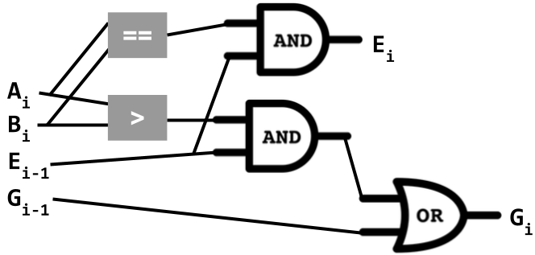
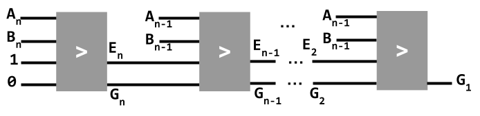
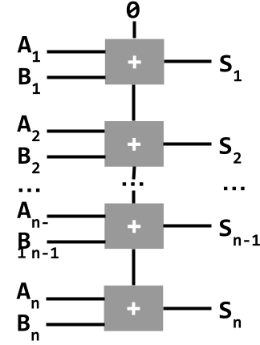

# Architecture: n-bit circuits; multiplexers
_COSC 208, Introduction to Computer Systems, 2024-03-06_

## Announcements
* Project 1 revisions due today @ 11pm

## Outline
* Warm-up
* n-bit circuits
* Multiplexer circuit

## Warm-up

* Q1: _Create a 1-bit circuit for `A <= B` using `AND`, `OR`, `NOT` gates_

| A | B | A <= B |
| - | - | ------ |
| 0 | 0 |   1    |
| 0 | 1 |   1    |
| 1 | 0 |   0    |
| 1 | 1 |   1    |


## n-bit Logical Circuits

* Q2: _Complete the truth-table for `A > B` when A and B are two bits_

| A1 A0 | B1 B0 | A > B |
| ----- | ----- | ----- |
| 0   0 | 0   0 |   0   |
| 0   1 | 0   0 |   1   |
| 1   0 | 0   0 |   1   |
| 1   1 | 0   0 |   1   |
| 0   0 | 0   1 |   0   |
| 0   1 | 0   1 |   0   |
| 1   0 | 0   1 |   1   |
| 1   1 | 0   1 |   1   |
| 0   0 | 1   0 |   0   |
| 0   1 | 1   0 |   0   |
| 1   0 | 1   0 |   0   |
| 1   1 | 1   0 |   1   |
| 0   0 | 1   1 |   0   |
| 0   1 | 1   1 |   0   |
| 1   0 | 1   1 |   0   |
| 1   1 | 1   1 |   0   |

* _How did you determine this?_
    * Convert to decimal — not an option for hardware
    * Compare 1st bits, then, if necessary, compare 2nd bits — `(A1 > B1) OR ((A1 == B1) AND (A0 > B0))`
* _What if there were 3 bits?_ 
    * Compare 1st bits, then, if necessary, 2nd bits, then, if necessary, 3rd bits
    * `(A2 > B2) OR ((A2 == B2) AND (A1 > B1)) OR ((A2 == B2) AND (A1 == B1) AND (A0 > B0))`
* _What do you need to know about previous bits?_
    * Is some previous bit greater?
    * Are all previous bits equal?
* N-bit greater-than circuit
    * Inputs
        * `Ai`
        * `Bi`
        * `Gi`
        * `Ei`
    * Outputs — _What are the formulas for these?_
        * `Gi`: `G(i+1) OR (E(i+1) AND (Ai > Bi))`
        * `Ei`: `E(i+1) AND (Ai == Bi)`
    * Circuit <br />  <br /> 

## n-bit arithmetic circuits

* Ripple adder
    * Adder
        * Inputs – `A`, `B`, carry in
        * Outputs - `sum`, carry out
        * Circuit <br /> 
    * Inputs – `An`, ..., `A1`, `Bn`, ..., `B1`
    * Outputs – `Sn`, ..., `S1`
    * Circuit <br /> 

## Multiplexer circuit

* Semantics
    ```
    select == 1 ==> output A's value
    select == 0 ==> output B's value
    ```
* Truth-table

| `select` | `A` | `B` | `out` |
|----------|-----|-----|-------|
|     0    |  0  |  0  |   0   |
|     0    |  0  |  1  |   1   |
|     0    |  1  |  0  |   0   |
|     0    |  1  |  1  |   1   |
|     1    |  0  |  0  |   0   |
|     1    |  0  |  1  |   0   |
|     1    |  1  |  0  |   1   |
|     1    |  1  |  1  |   1   |

* Logical formula
    ```
    (NOT(select) AND NOT(A) AND (B)) OR
    (NOT(select) AND (A) AND (B)) OR
    (select AND (A) AND (B)) OR
    (select AND (A) AND NOT(B)) OR
    ```
* Simplified logical formula
    ```
    (NOT(select) AND (B)) OR (select AND (A))
    ```
* Circuit
    
    
* Given n selection bits, mux select between 2^n different inputs

## Extra practice

* Q3: _Draw a 1-bit circuit for `A < B` using only `AND`, `OR`, and `NOT` gates. Show your work (i.e., any intermediate design steps you took)._

| A | B | A < B |
| - | - | ----- |
| 0 | 0 |   0   |
| 0 | 1 |   1   |
| 1 | 0 |   0   |
| 1 | 1 |   0   |

```
NOT(A) AND B
```


