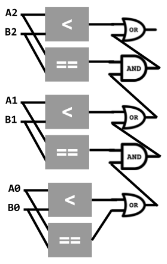
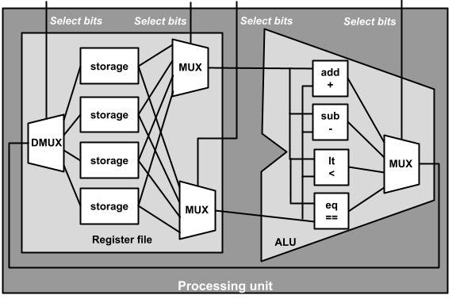
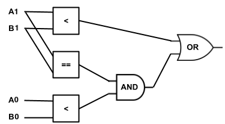

# Architecture: processing unit
_COSC 208, Introduction to Computer Systems, 2024-03-08_

## Announcements
* Quiz 3 Wednesday after spring break (March 20)
    * 2.1: Determine the contents of the stack and heap during a program’s execution
    * 2.2: Develop C **code** that appropriately uses arrays and pointer arithmetic
    * 2.4: Correct memory errors in C **code** with the assistance of a compiler and valgrind
    * 3.1: Design single- and multi-bit circuits for arithmetic and comparison operators
    * 3.2: Design a simple processing unit and explain how it executes assembly instructions
    * Optional: attempt one of...
        * 1.1: Develop C **code** that appropriately manipulates numbers, characters, and strings
        * 1.2: Convert signed and unsigned numbers between decimal, binary, and hexadecimal
        * 1.3: Compute the results of arithmetic and bitwise operators in binary
* Project 2 due 1.5 weeks after spring break (Wed, March 27 @ 11pm)
    * If you will be off-campus during break and want to use your RPi, you should do the following before you leave campus: (1) install VPN on your laptop; (2) leave your RPi plugged in and power on in your on-campus residence. Once you are off campus, you can: (1) connect to the campus VPN; (2) connect to your RPi using VSCode as normal; (3) close your VSCode session without running sudo poweroff, to ensure your RPi remains powered on.

## Outline
* Warm-up
* Processing unit
* Assembly instructions

## Warm-up

* Q1: _Draw a circuit that takes two 3-bit unsigned numbers (`0b A2 A1 A0` and `0b B2 B1 B0`) and outputs a single bit that indicates whether the first number is less than or equal to the second number. Assume you have access to an unlimited supply of `AND`, `OR`, and `NOT` gates and 1-bit greater-than, less-than, and equal-to circuits, as shown below_

  

  

## Multiplexer circuit

* 2-way multiplixer
    * Takes three inputs
        * Input A
        * Input B
        * Select bit
    * Semantics
        * select == 1 → output A's value
        * select == 0 → output B's value
    * Circuit
        
    
* Given n selection bits, mux select between 2^n different inputs

## Processing Unit

## Assembly instructions

* Simple instructions a processor can execute – e.g., add two integers, compare two integers, load/store a value from/to main memory
* C code is compiled into assembly code
    * Python code is interpreted; interpreter is compiled into assembly
    * Java code is compiled to Java byte code, which is executed by the Java Virtual Machine (JVM); JVM is compiled into assembly
* Assembly instructions are expressed in binary
    * Some bits determine the operation – used as select bits for the multiplexer between the arithmetic and logic circuits and the ALU's output
    * Some bits determine the first source register and other bits determine the second source register – used as select bits for the multiplexers between the register file's outputs and ALU's inputs
    * Some bits determine the destination register – used as select bits for the demultiplexer between the ALU's output and register file's input
* E.g., our simple processor uses 8-bit assembly instructions
    * First (i.e., left-most) two bits determine operation
    * Next two bits determine destination register
    * Next two bits determine first source register
    * Final (i.e., right-most) two bits determine second source register

* Instruction set architectures (ISAs) — defines the low-level instructions a central processing unit (CPU), or processor, can execute
    * Most popular Complex Instruction Set Computer (CISC) architecture: x86 (includes IA32 and x86-64)
    * Most popular Reduced Instruction Set Computer (RISC) architecture: ARM
    * Other common RISC architectures: SPARC (Scalable Processor Architecture), MIPS (Microprocessor without Interlocked Pipelined Stages), PowerPC, ARC (Argonaut RISC Core)

## Extra practice

* Q2: _Draw a circuit that takes two 3-bit **signed** numbers (`0b A2 A1 A0` and `0b B2 B1 B0`) and outputs a single bit that indicates whether the first number is **greater than** the second number. Assume you have access to an unlimited supply of `AND`, `OR`, and `NOT` gates and 1-bit greater-than, less-than, and equal-to circuits._

* Q3: _Assume you have access to 1-bit circuits for `A < B`, `A == B`, and `A > B` and logic gates for `AND`, `OR`, and `NOT`. Draw a 2-bit circuit for `A < B` which uses the existing circuits and logic gates. Assume `A1` and `B1` are the most significant bits, and `A2` and `B2` are the least significant bits._

| A1 A2 | B1 B2 | A < B |
| ----- | ----- | ----- |
| 0   0 | 0   0 |   0   |
| 0   1 | 0   0 |   0   |
| 1   0 | 0   0 |   0   |
| 1   1 | 0   0 |   0   |
| 0   0 | 0   1 |   1   |
| 0   1 | 0   1 |   0   |
| 1   0 | 0   1 |   0   |
| 1   1 | 0   1 |   0   |
| 0   0 | 1   0 |   1   |
| 0   1 | 1   0 |   1   |
| 1   0 | 1   0 |   0   |
| 1   1 | 1   0 |   0   |
| 0   0 | 1   1 |   1   |
| 0   1 | 1   1 |   1   |
| 1   0 | 1   1 |   1   |
| 1   1 | 1   1 |   0   |

