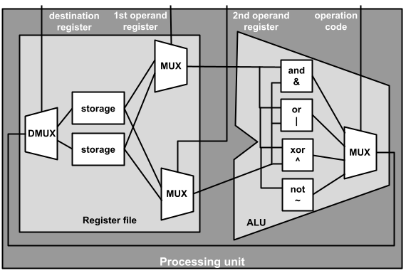
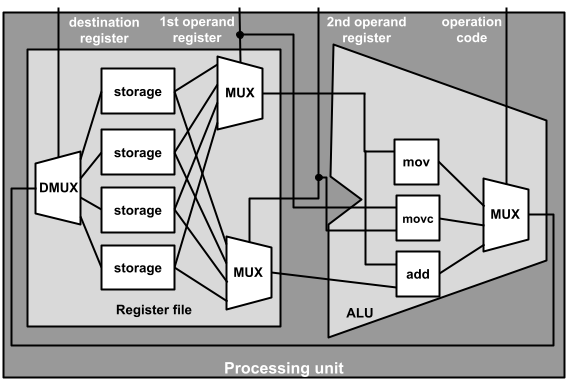

# Assembly: operations and operands
_COSC 208, Introduction to Computer Systems, 2024-03-08_

## Announcements
* Quiz 3 Wednesday
    * 2.1: Determine the contents of the stack and heap during a program’s execution
    * 2.2: Develop C **code** that appropriately uses arrays and pointer arithmetic
    * 2.4: Correct memory errors in C **code** with the assistance of a compiler and valgrind
    * 3.1: Design single- and multi-bit circuits for arithmetic and comparison operators
    * 3.2: Design a simple processing unit and explain how it executes assembly instructions
    * Optional: attempt one of...
        * 1.1: Develop C **code** that appropriately manipulates numbers, characters, and strings
        * 1.2: Convert signed and unsigned numbers between decimal, binary, and hexadecimal
        * 1.3: Compute the results of arithmetic and bitwise operators in binary
* Project 2 due Wednesday, March 27 @ 11pm – connect with your partner and decide on a game **no later than tomorrow**

## Outline
* Warm-up
* Assembly
* Viewing assembly code
* Operands

## Warm-up

* Q1: _Draw the circuitry for a processing unit that has two general purpose registers (r0 and r1) and supports four bitwise operations (`&`, `|`, `^`, `~`). Assume you already have storage, MUX, DMUX, and bitwise operations (`&`, `|`, `^`, `~`) circuits available as building blocks._



## Assembly instructions

* Simple instructions a processor can execute – e.g., add two integers, compare two integers, load/store a value from/to main memory
* C code is compiled into assembly code
    * Python code is interpreted; interpreter is compiled into assembly
    * Java code is compiled to Java byte code, which is executed by the Java Virtual Machine (JVM); JVM is compiled into assembly
* Assembly instructions are expressed in binary
    * Some bits determine the operation – used as select bits for the multiplexer between the arithmetic and logic circuits and the ALU's output
    * Some bits determine the first source register and other bits determine the second source register – used as select bits for the multiplexers between the register file's outputs and ALU's inputs
    * Some bits determine the destination register – used as select bits for the demultiplexer between the ALU's output and register file's input
* E.g., our simple processor from the warm-up uses 5-bit assembly instructions
    * First (i.e., left-most) two bits determine operation
    * Next bit determines destination register
    * Next bit determines first source register
    * Final (i.e., right-most) bit determinse second source register
* Instruction set architectures (ISAs) — defines the low-level instructions a central processing unit (CPU), or processor, can execute
    * Most popular Complex Instruction Set Computer (CISC) architecture: x86 (includes IA32 and x86-64)
    * Most popular Reduced Instruction Set Computer (RISC) architecture: ARM
    * Other common RISC architectures: SPARC (Scalable Processor Architecture), MIPS (Microprocessor without Interlocked Pipelined Stages), PowerPC, ARC (Argonaut RISC Core)
* Our goal: to understand the relationship between C code and its corresponding assembly code to make informed programming decisions

## Viewing assembly code

* Example program (`dogyears.c`)


```c
/* 1*/   #include <stdio.h>
/* 2*/   #include <stdlib.h>
/* 3*/   int dog_years(int birth) {
/* 4*/       int current = 2023;
/* 5*/       int years = current - birth;
/* 6*/       years = years * 7;
/* 7*/       return years;
/* 8*/   }
/* 9*/   int main() {
/*10*/       printf("What year were you born? ");
/*11*/       char year[5];
/*12*/       fgets(year, 5, stdin);
/*13*/       int dog_age = dog_years(atoi(year));
/*14*/       printf("You are %d dog years old\n", dog_age);
/*15*/   }
```

* Viewing assembly code
    * Compile: `gcc -fomit-frame-pointer -o dogyears dogyears.c`
    * Disassemble executable: `objdump -d dogyears > dogyears.txt`

* Assembly code (excerpt from `dogyears.txt`)
    ```
    0000000000000914 <dog_years>:
     914:   d10083ff        sub     sp, sp, #0x20
     918:   b9000fe0        str     w0, [sp, #12]
     91c:   5280fce0        mov     w0, #0x7e7
     920:   b9001be0        str     w0, [sp, #24]
     924:   b9401be1        ldr     w1, [sp, #24]
     928:   b9400fe0        ldr     w0, [sp, #12]
     92c:   4b000020        sub     w0, w1, w0
     930:   b9001fe0        str     w0, [sp, #28]
     934:   b9401fe1        ldr     w1, [sp, #28]
     938:   2a0103e0        mov     w0, w1
     93c:   531d7000        lsl     w0, w0, #3
     940:   4b010000        sub     w0, w0, w1
     944:   b9001fe0        str     w0, [sp, #28]
     948:   b9401fe0        ldr     w0, [sp, #28]
     94c:   910083ff        add     sp, sp, #0x20
     950:   d65f03c0        ret
    ```

* _What do each of the columns contain?_
    * Code memory address
    * Bytes corresponding to instruction
    * Operation
        * sub – subtraction
        * str – store (i.e., copy) a value from a register into main memory
        * mov – move (i.e., copy) into a register a constant or a value from another register
        * ldr – load (i.e., copy) a value from main memory into a register
        * lsl – logical shift left (i.e., `<<`)
        * add – addition
        * ret – return from function call
    * Operands

## Operands

* Registers
    * General purpose registers
        * `w0` through `w30` (32-bit) 
        * `x0` through `x30` (64-bit)
    * Stack pointer `sp` – memory address of the top of the current stack frame
    * Program counter `pc` – memory address of the current instruction
* Constant
    * In hex — e.g., `#0x20`
    * In decimal — e.g., `#8`
* Memory – only used in `ldr` (load) and `str` (store) instructions, which copy data between main memory and the processor
    * Dereference — e.g., `[x1]`
    * Add to memory address, then dereference — e.g., `[sp,#16]`

## Extra practice

* Q2: _Draw the circuitry for a processing unit that has four general purpose registers (r0-r3) and supports four operations:_
    * `nop`: no operation; do nothing
    * `mov`: copy a value from one register to another
    * `movc`: store a constant value into a register, where the constant comes from the last four bits of the instruction
    * `add`: add the values in two registers and store the result in a register


