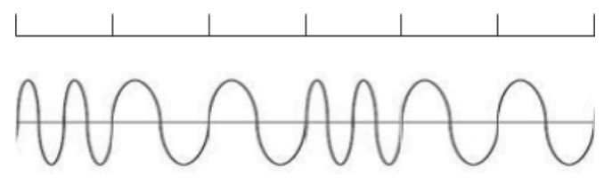
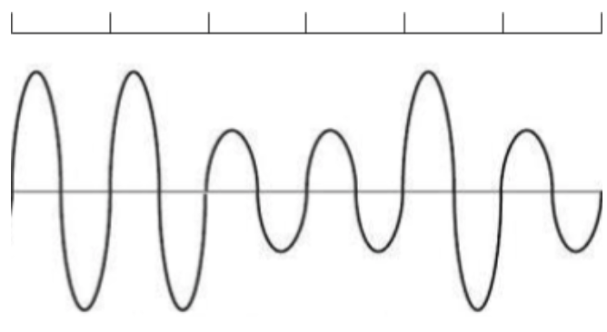

# Networking: Wireless
_COSC 208, Introduction to Computer Systems, 2021-12-08_

## Announcements
* Attend faculty candidate research talks
    * 11:20am Wed, Dec 15
    * Earn 2 points of extra credit on final exam for each talk you attend (earnings capped at 4 points)

## Outline
* Warm-up
* Wireless encoding
* Frequency spectrum
* Medium access control

## Warm-up
Q1: _You discover two different devices connected to the same network use the IP addresses `128.105.2.44` and `128.105.2.88.` What is the network portion of these IP addresses?_
```


```

Q2: _You discover a third device connected to the same network uses the IP address `128.105.6.60`. Does this change your answer to the preceding question? If so, what is your new answer?_
```


```
🛑 **STOP HERE** after completing the warm-up; please **DO NOT WORK AHEAD**.

## Wireless encoding
_What is the sequence of bits encoded by each of these wireless signals?_

Q3



Q4

