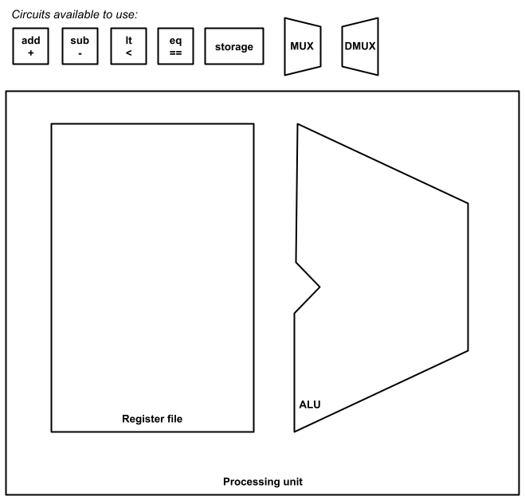

# Review: Exam 2
_COSC 208, Introduction to Computer Systems, 2023-03-31_

## Announcements
* Exam 2
    * Study guide posted on Moodle
    * Take-home portion: due at the beginning of class on Monday
    * In-class portion: during class on Monday

## Outline
* Trace assembly code with function calls
* Exam 2 review

## No warm-up – Happy Friday!

## Tracing assembly code with function calls

```
0000000000400544 <multiply>:                           //
    400544:    d10043ff     sub    sp, sp, #0x10       //
    400548:    b9000fe0     str    w0, [sp, #12]       //
    40054c:    b9000be1     str    w1, [sp, #8]        //
    400550:    b9400fe8     ldr    w8, [sp, #12]       //
    400554:    b9400be9     ldr    w9, [sp, #8]        //
    400558:    1b097d08     mul    w8, w8, w9          //
    40055c:    b90007e8     str    w8, [sp, #4]        //
    400560:    b94007e0     ldr    w0, [sp, #4]        //
    400564:    910043ff     add    sp, sp, #0x10       //
    400568:    d65f03c0     ret                        //
```

```
000000000040056c <volume>:                             //
    40056c:    d10083ff     sub    sp, sp, #0x20       //
    400570:    f9000bfe     str    x30, [sp, #16]      //
    400574:    b9000fe0     str    w0, [sp, #12]       //
    400578:    b9000be1     str    w1, [sp, #8]        //
    40057c:    b90007e2     str    w2, [sp, #4]        //
    400580:    b9400fe0     ldr    w0, [sp, #12]       //
    400584:    b9400be1     ldr    w1, [sp, #8]        //
    400588:    97ffffef     bl     400544 <multiply>   // 
    40058c:    b90003e0     str    w0, [sp]            //
    400590:    b94003e0     ldr    w0, [sp]            //
    400594:    b94007e1     ldr    w1, [sp, #4]        //
    400598:    97ffffeb     bl     400544 <multiply>   // 
    40059c:    b90003e0     str    w0, [sp]            //
    4005a0:    b94003e0     ldr    w0, [sp]            //
    4005a4:    f9400bfe     ldr    x30, [sp, #16]      //
    4005a8:    910083ff     add    sp, sp, #0x20       //
    4005ac:    d65f03c0     ret                        //
```

```
00000000004005b0 <main>:                               //
    4005b0:    d10083ff     sub    sp, sp, #0x20       //
    4005b4:    f9000bfe     str    x30, [sp, #16]      //
    4005b8:    52800020     mov    w0, #0x1            //
    4005bc:    52800061     mov    w1, #0x3            //
    4005c0:    528000a2     mov    w2, #0x5            //
    4005c4:    97ffffe9     bl     40056c <volume>     //
    4005c8:    b9000be0     str    w0, [sp, #8]        //
    4005cc:    b9400be0     ldr    w0, [sp, #8]        //
    4005d0:    f9400bfe     ldr    x30, [sp, #16]      //
    4005d4:    910083ff     add    sp, sp, #0x20       //
    4005d8:    d65f03c0     ret                        //
```

* Assume the registers have the following initial values:
    * `pc` = `0x4005b0`
    * `sp` = `0xFF0`
    * `x30` = `0x4005dc`

<div style="page-break-after:always;"></div>

## Dynamic memory allocation

Q1: _The function below allocates several regions of memory on the heap. Draw a diagram that depicts the contents of the stack and heap at the end of main. Label each memory region with its size in bytes.)_


```c
#include <stdlib.h>
int main() {
    char **alpha = malloc(sizeof(char *) * 4);
    char **beta = alpha;
    for (int i = 1; i < 4; i++) {
        alpha[i] = malloc(sizeof(char) * i);
        *alpha[i] = i + 'a';
        *beta = alpha[i];
        beta++;
    }
}
```

<div style="page-break-after:always;"></div>

## Data structures using dynamic memory allocation

Q2: _The following code provides a function to add an integer value to the end of a queue:_


```c
#include <stdlib.h>
struct item {
    int value;
    struct item *next;
}   
struct item *enqueue(struct item *head, int value) {
    // Allocate new item and populate
    struct item *new = malloc(sizeof(struct item));
    new->value = value;
    new->next = NULL;

    // Item becomes new head if queue is empty
    if (NULL == head) {
        return next;
    }
    
    // Item goes at the end of the queue
    while (head->next != NULL) {
        head = head->next;
    }
    head->next = new;
    return new;
}
```

_Write a corresponding `dequeue` function that removes the head of the queue, stores its value in the memory location pointed to by the `result` argument, and returns the new head (which may be `NULL`). If the queue is empty, return `NULL` and leave the contents of result untouched. Your function should be written such that there are no memory leaks._

<div style="page-break-after:always;"></div>

## Circuits

Q3: _Draw a 1-bit circuit for `A < B` using only `AND`, `OR`, and `NOT` gates. Show your work (i.e., any intermediate design steps you took)._

<p style="height:20em;"></p>

Q4: _Assume you have access to 1-bit circuits for `A < B`, `A == B`, and `A > B` and logic gates for `AND`, `OR`, and `NOT`. Draw a 2-bit circuit for `A < B` which uses the existing circuits and logic gates. Assume `A1` and `B1` are the most significant bits, and `A2` and `B2` are the least significant bits._

<div style="page-break-after:always;"></div>

Q5: _Use the available circuits to create a processing unit with four registers and four operations (`+`, `-`, `<`, and `==`)._



<div style="page-break-after:always;"></div>

## Assembly
### C code


```c
/* 1*/  int interest_due(int outstanding, int rate) {
/* 2*/      int divisor = 1200;
/* 3*/      int annual = outstanding * rate;
/* 4*/      int monthly = annual / divisor;
/* 5*/      return monthly;
/* 6*/  }
/* 7*/
/* 8*/  int make_payment(int outstanding, int payment, int rate) {
/* 9*/      int interest = interest_due(outstanding, rate);
/*10*/      int principal = payment - interest;
/*11*/      if (principal > outstanding) {
/*12*/          outstanding = 0;
/*13*/      } else {
/*14*/          outstanding -= principal;    
/*15*/      }
/*16*/      return outstanding;
/*17*/  }
```

### Assembly code
```
00000000004005d4 <interest_due>:                // Line 
  4005d4:    d10083ff     sub    sp, sp, #0x20  //
  4005d8:    b9001fe0     str    w0, [sp, #28]  //
  4005dc:    b9001be1     str    w1, [sp, #24]  //
  4005e0:    52809608     mov    w8, #0x4b0     //
  4005e4:    b90017e8     str    w8, [sp, #20]  //
  4005e8:    b9401fe8     ldr    w8, [sp, #28]  //
  4005ec:    b9401be9     ldr    w9, [sp, #24]  //
  4005f0:    1b097d08     mul    w8, w8, w9     //
  4005f4:    b90013e8     str    w8, [sp, #16]  //
  4005f8:    b94013e8     ldr    w8, [sp, #16]  //
  4005fc:    b94017e9     ldr    w9, [sp, #20]  //
  400600:    1ac90d08     sdiv   w8, w8, w9     //
  400604:    b9000fe8     str    w8, [sp, #12]  //
  400608:    b9400fe0     ldr    w0, [sp, #12]  //
  40060c:    910083ff     add    sp, sp, #0x20  //
  400610:    d65f03c0     ret                   //
```

```
0000000000400614 <make_payment>:                 // Line     Low-level C   
  400614:    d100c3ff     sub    sp, sp, #0x30   //
  400618:    f90013fe     str    x30, [sp, #32]  //
  40061c:    b9001fe0     str    w0, [sp, #28]   //
  400620:    b9001be1     str    w1, [sp, #24]   //
  400624:    b90017e2     str    w2, [sp, #20]   //
  400628:    b9401fe0     ldr    w0, [sp, #28]   //
  40062c:    b94017e1     ldr    w1, [sp, #20]   //
  400630:    97ffffe9     bl     4005d4 <interest_due>  //
  400634:    b90013e0     str    w0, [sp, #16]   //
  400638:    b9401be8     ldr    w8, [sp, #24]   //
  40063c:    b94013e9     ldr    w9, [sp, #16]   //
  400640:    6b090108     subs   w8, w8, w9      //
  400644:    b9000fe8     str    w8, [sp, #12]   //
  400648:    b9400fe8     ldr    w8, [sp, #12]   //
  40064c:    b9401fe9     ldr    w9, [sp, #28]   //
  400650:    6b09011f     cmp    w8, w9          //
  400654:    5400006d     b.le   400660 <make_payment+0x4c>  //
  400658:    b9001fff     str    wzr, [sp, #28]  //
  40065c:    14000005     b      400670 <make_payment+0x5c>  //
  400660:    b9400fe8     ldr    w8, [sp, #12]   //
  400664:    b9401fe9     ldr    w9, [sp, #28]   //
  400668:    6b080128     subs   w8, w9, w8      //
  40066c:    b9001fe8     str    w8, [sp, #28]   //
  400670:    b9401fe0     ldr    w0, [sp, #28]   //
  400674:    f94013fe     ldr    x30, [sp, #32]  //
  400678:    9100c3ff     add    sp, sp, #0x30   //
  40067c:    d65f03c0     ret                    //
```

Q6: _For each line of assembly code, **indicate which line of C code was used to generate that line of assembly** code._

Q7: _For each line of assembly in **`make_payment`, write one or more lines of low-level C code** that express the semantics (i.e., meaning) of the assembly code. Your C code should use register names as variable names._

### Transforming C code to use goto
Q8: _Create a `make_payment_goto` function that behaves the same as the `make_payment` function but uses `goto` statements, just as a compiler would do when generating assembly code._

<div style="page-break-after:always;"></div>

### Tracing assembly code
Q9: _Assume the code starts executing at the beginning of the `make_payment` function (i.e., `pc = 0x400614)`. Draw a digram that shows the contents of the stack and registers immediately before executing the `ret` instruction in the `interest_due` function (i.e., before executing the assembly instruction at address `0x400610`). Your stack and registers should contain values (e.g., `0x400614`) *not* variable or register names._

_Assume the initial values of the registers are as follows:_
* `pc = 0x400614`
* `sp = 0xf80`
* `w0 = 100000`
* `w1 = 500`
* `w2 = 3`
* `x30 = 0x96c`
