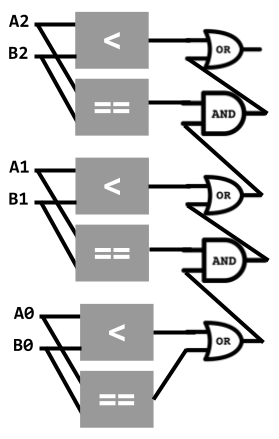
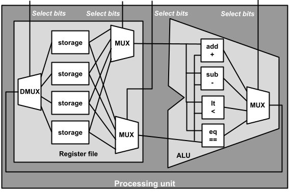
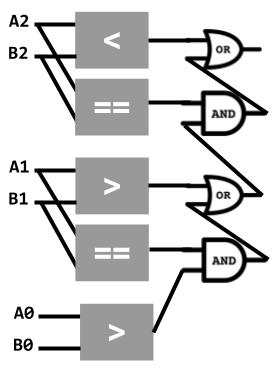

# Architecture: Processing unit
_COSC 208, Introduction to Computer Systems, 2023-10-13_

## Announcements
* Project 2 due Thurs, Oct 19 @ 11pm

## Outline
* Warm-up
* Processing unit
* Assembly instructions

## Warm-up

* Q1: _Draw a circuit that takes two 3-bit unsigned numbers (`0b A2 A1 A0` and `0b B2 B1 B0`) and outputs a single bit that indicates whether the first number is less than or equal to the second number. Assume you have access to an unlimited supply of `AND`, `OR`, and `NOT` gates and 1-bit greater-than, less-than, and equal-to circuits, as shown below_

  

  

## Processing Unit & Assembly Instructions

* Simple instructions a processor can execute – e.g., add two integers, compare two integers, load/store a value from/to main memory
* C code is compiled into assembly code
    * Python code is interpreted; interpreter is compiled into assembly
    * Java code is compiled to Java byte code, which is executed by the Java Virtual Machine (JVM); JVM is compiled into assembly
* Assembly instructions are expressed in binary
    * Some bits determine the operation – used as select bits for the multiplexer between the arithmetic and logic circuits and the ALU's output
    * Some bits determine the first source register and other bits determine the second source register – used as select bits for the multiplexers between the register file's outputs and ALU's inputs
    * Some bits determine the destination register – used as select bits for the demultiplexer between the ALU's output and register file's input
* E.g., our simple processor uses 8-bit assembly instructions
    * First (i.e., left-most) two bits determine operation
    * Next two bits determine destination register
    * Next two bits determine first source register
    * Final (i.e., right-most) two bits determine second source register

* Instruction set architectures (ISAs) — defines the low-level instructions a central processing unit (CPU), or processor, can execute
    * Most popular Complex Instruction Set Computer (CISC) architecture: x86 (includes IA32 and x86-64)
    * Most popular Reduced Instruction Set Computer (RISC) architecture: ARM
    * Other common RISC architectures: SPARC (Scalable Processor Architecture), MIPS (Microprocessor without Interlocked Pipelined Stages), PowerPC, ARC (Argonaut RISC Core)

## Extra practice

* Q2: _Draw a circuit that takes two 3-bit **signed** numbers (`0b A2 A1 A0` and `0b B2 B1 B0`) and outputs a single bit that indicates whether the first number is **greater than** the second number. Assume you have access to an unlimited supply of `AND`, `OR`, and `NOT` gates and 1-bit greater-than, less-than, and equal-to circuits._

