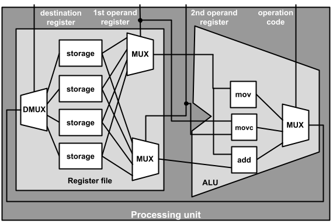

# Assembly: operations and operands; mapping assembly to C
_COSC 208, Introduction to Computer Systems, 2023-10-16_

## Announcements
* Exam 1 grades on Moodle
* Testing output for Exam 1 coding portion in Github repositories
* Project 2 due Thursday @ 11pm

## Outline
* Processor design
* Viewing assembly code
* Operands
* Mapping assembly to C

## Processor Design 

* Q1: _Draw the circuitry for a processing unit that has two general purpose registers (r0 and r1) and supports four bitwise operations (`&`, `|`, `^`, `~`). Assume you already have storage, MUX, DMUX, and bitwise operations (`&`, `|`, `^`, `~`) circuits available as building blocks._


* Q2: _For this processor's assembly language, how many bits are required for the operation code?_

    2

* Q3: _For this processor's assembly language, how many bits are required for a complete instruction?_

    5

* Q4: _What is the binary representation of the assembly instruction for `r0 = r0 ^ r1`?_

    0b10001

* Q5: _If the processing unit is fed the instruction `0b11110` what will the processing unit do?_

    r1 = ~r1

* Q6: _If the processing unit you is fed the instruction `0b11111` what will the processing unit do?_

    r1 = ~r1

* Q7: _If the processing unit contained 16 registers instead of 2, how many bits would be required for a complete assembly instruction?_

    18 = 2 + 4 + 4 + 4

## Viewing assembly code

* Goal is to understand the relationship between C code and its corresponding assembly code to make informed programming decisions

* Example program (`dogyears.c`)


```c
/* 1*/   #include <stdio.h>
/* 2*/   #include <stdlib.h>
/* 3*/   int dog_years(int birth) {
/* 4*/       int current = 2023;
/* 5*/       int years = current - birth;
/* 6*/       years = years * 7;
/* 7*/       return years;
/* 8*/   }
/* 9*/   int main() {
/*10*/       printf("What year were you born? ");
/*11*/       char year[5];
/*12*/       fgets(year, 5, stdin);
/*13*/       int dog_age = dog_years(atoi(year));
/*14*/       printf("You are %d dog years old\n", dog_age);
/*15*/   }
```

* Viewing assembly code
    * Compile: `gcc -fomit-frame-pointer -o dogyears dogyears.c`
    * Disassemble executable: `objdump -d dogyears > dogyears.txt`

* Assembly code (excerpt from `dogyears.txt`)
```
0000000000000914 <dog_years>:
 914:   d10083ff        sub     sp, sp, #0x20
 918:   b9000fe0        str     w0, [sp, #12]
 91c:   5280fce0        mov     w0, #0x7e7
 920:   b9001be0        str     w0, [sp, #24]
 924:   b9401be1        ldr     w1, [sp, #24]
 928:   b9400fe0        ldr     w0, [sp, #12]
 92c:   4b000020        sub     w0, w1, w0
 930:   b9001fe0        str     w0, [sp, #28]
 934:   b9401fe1        ldr     w1, [sp, #28]
 938:   2a0103e0        mov     w0, w1
 93c:   531d7000        lsl     w0, w0, #3
 940:   4b010000        sub     w0, w0, w1
 944:   b9001fe0        str     w0, [sp, #28]
 948:   b9401fe0        ldr     w0, [sp, #28]
 94c:   910083ff        add     sp, sp, #0x20
 950:   d65f03c0        ret
```

## Assembly Format
* Code memory address
* Bytes corresponding to instruction
* Operation
    * sub – subtraction
    * str – store (i.e., copy) a value from a register into main memory
    * mov – move (i.e., copy) into a register a constant or a value from another register
    * ldr – load (i.e., copy) a value from main memory into a register
    * lsl – logical shift left (i.e., `<<`)
    * add – addition
    * ret – return from function call
* Operands

## Operands

* Registers
    * General purpose registers
        * `w0` through `w30` (32-bit) 
        * `x0` through `x30` (64-bit)
    * Stack pointer `sp` – memory address of the top of the current stack frame
    * Program counter `pc` – memory address of the current instruction
* Constant
    * In hex — e.g., `#0x20`
    * In decimal — e.g., `#8`
* Memory – only used in `ldr` (load) and `str` (store) instructions, which copy data between main memory and the processor
    * Dereference — e.g., `[x1]`
    * Add to memory address, then dereference — e.g., `[sp,#16]`

## Mapping assembly code to C code

* Function begin pattern
    * create stack frame by decreasing (`sub`) stack pointer
    * store (`str`) parameters from registers w/x0, w/x1, etc. into the stack in main memory
* Local variable initialization pattern
    * move (mov) constant value into register
    * store (str) register value onto the stack
* Mathematical operation pattern
    * load (`ldr`) first operand from the stack into a register OR move (`mov`) first operand constant into a regster
    * load (`ldr`) second operand from the stack into a register OR move (`mov`) second operand constant into a regster
    * compute
    * store (`str`) resulting value from a register into the stack
* Function return/end pattern
    * load (`ldr`) return value from the stack into the w/x0 register
    * destroy stack frame by increasing (`add`) stack pointer
    * return (`ret`) to caller

```
    0000000000000914 <dog_years>:
     914:   d10083ff        sub     sp, sp, #0x20  // Line 3: create stack frame
     918:   b9000fe0        str     w0, [sp, #12]  // Line 3: store parameter
     91c:   5280fce0        mov     w0, #0x7e7     // Line 4: assign initial value to local variable
     920:   b9001be0        str     w0, [sp, #24]  //      V
     924:   b9401be1        ldr     w1, [sp, #24]  // Line 5: load first operand 
     928:   b9400fe0        ldr     w0, [sp, #12]  // Line 5: load second operand
     92c:   4b000020        sub     w0, w1, w0     // Line 5: subtract
     930:   b9001fe0        str     w0, [sp, #28]  // Line 5: store result in local variable
     934:   b9401fe1        ldr     w1, [sp, #28]  // Line 6: load first operand
     938:   2a0103e0        mov     w0, w1                 V
     93c:   531d7000        lsl     w0, w0, #3     // Line 6: multiply
     940:   4b010000        sub     w0, w0, w1     //      V
     944:   b9001fe0        str     w0, [sp, #28]  // Line 6: store result in local variable
     948:   b9401fe0        ldr     w0, [sp, #28]  // Line 7: prepare return value
     94c:   910083ff        add     sp, sp, #0x20  // Line 7: destroy stack frame
     950:   d65f03c0        ret                    // Line 7: return to caller
```

* Q5: _For each line of assembly, indicate which original line of C code the assembly instruction was derived from._


```c
/* 1*/  #include <stdio.h>
/* 2*/  int years_to_double(int rate) {
/* 3*/      int ruleof72 = 72;
/* 4*/      int years = ruleof72 / rate;
/* 5*/      return years;
/* 6*/  }
/* 7*/  int main() {
/* 8*/      int r = 10;
/* 9*/      int y = years_to_double(r);
/*10*/      printf("With an interest rate of %d%% it 
                   will take ~%d years to double your money\n", r, y);
/*11*/  }
```

    With an interest rate of 10% it will take ~7 years to double your money


```
000000000000076c <years_to_double>:
    76c:	d10083ff 	sub  sp, sp, #0x20   // 2
    770:	b9000fe0 	str  w0, [sp, #12]   // 2
    774:	52800900 	mov  w0, #0x48       // 3
    778:	b9001be0 	str  w0, [sp, #24]   // 3
    77c:	b9401be1 	ldr  w1, [sp, #24]   // 4
    780:	b9400fe0 	ldr  w0, [sp, #12]   // 4
    784:	1ac00c20 	sdiv w0, w1, w0      // 4
    788:	b9001fe0 	str  w0, [sp, #28]   // 4
    78c:	b9401fe0 	ldr  w0, [sp, #28]   // 5
    790:	910083ff 	add  sp, sp, #0x20   // 5
    794:	d65f03c0 	ret                  // 5
```

## Extra practice

* Q9: _Draw the circuitry for a processing unit that has four general purpose registers (r0-r3) and supports four operations:_
    * `nop`: no operation; do nothing
    * `mov`: copy a value from one register to another
    * `movc`: store a constant value into a register, where the constant comes from the last four bits of the instruction
    * `add`: add the values in two registers and store the result in a register


