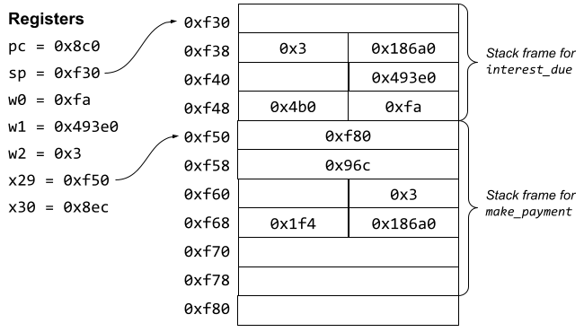

# Exam 2 Review
_COSC 208, Introduction to Computer Systems, 2021-10-22_


## Mapping assembly code to C source code

```C
  1  int interest_due(int outstanding, int rate) {
  2      int annual = outstanding * rate;
  3      int divisor = 12 * 100;
  4      int monthly = annual / divisor;
  5      return monthly;
  6  }
  7
  8  int make_payment(int outstanding, int payment, int rate) {
  9      int interest = interest_due(outstanding, rate);
 10      int principal = payment - interest;
 11      if (principal > outstanding) {
 12          outstanding = 0;
 13      }
 14      else {
 15          outstanding -= principal;	
 16      }
 17      return outstanding;
 18  }
 19
 20  int months_remain(int outstanding, int payment, int rate) {
 21      int months = 0;
 22      while (outstanding > 0) {
 23          months++;
 24          outstanding = make_payment(outstanding, payment, rate);
 25      }
 26      return months;
 27  }
```

### Assembly for the C code above
```
000000000000088c <interest_due>:
 88c:	sub	sp, sp, #0x20
 890:	str	w0, [sp, #12]
 894:	str	w1, [sp, #8]
 898:	ldr	w1, [sp, #12]
 89c:	ldr	w0, [sp, #8]
 8a0:	mul	w0, w1, w0
 8a4:	str	w0, [sp, #20]
 8a8:	mov	w0, #0x4b0
 8ac:	str	w0, [sp, #24]
 8b0:	ldr	w1, [sp, #20]
 8b4:	ldr	w0, [sp, #24]
 8b8:	sdiv	w0, w1, w0
 8bc:	str	w0, [sp, #28]
 8c0:	ldr	w0, [sp, #28]
 8c4:	add	sp, sp, #0x20
 8c8:	ret
 ```
 <div style="page-break-after: always;"></div>

```
00000000000008cc <make_payment>:
 8cc:	stp	x29, x30, [sp, #-48]!
 8d0:	mov	x29, sp
 8d4:	str	w0, [sp, #28]
 8d8:	str	w1, [sp, #24]
 8dc:	str	w2, [sp, #20]
 8e0:	ldr	w1, [sp, #20]
 8e4:	ldr	w0, [sp, #28]
 8e8:	bl	88c <interest_due>
 8ec:	str	w0, [sp, #40]
 8f0:	ldr	w1, [sp, #24]
 8f4:	ldr	w0, [sp, #40]
 8f8:	sub	w0, w1, w0
 8fc:	str	w0, [sp, #44]
 900:	ldr	w1, [sp, #44]
 904:	ldr	w0, [sp, #28]
 908:	cmp	w1, w0
 90c:	b.le	918 <make_payment+0x4c>
 910:	str	wzr, [sp, #28]
 914:	b	928 <make_payment+0x5c>
 918:	ldr	w1, [sp, #28]
 91c:	ldr	w0, [sp, #44]
 920:	sub	w0, w1, w0
 924:	str	w0, [sp, #28]
 928:	ldr	w0, [sp, #28]
 92c:	ldp	x29, x30, [sp], #48
 930:	ret

0000000000000934 <months_remain>:
 934:	stp	x29, x30, [sp, #-48]!
 938:	mov	x29, sp
 93c:	str	w0, [sp, #28]
 940:	str	w1, [sp, #24]
 944:	str	w2, [sp, #20]
 948:	str	wzr, [sp, #44]
 94c:	b	970 <months_remain+0x3c>
 950:	ldr	w0, [sp, #44]
 954:	add	w0, w0, #0x1
 958:	str	w0, [sp, #44]
 95c:	ldr	w2, [sp, #20]
 960:	ldr	w1, [sp, #24]
 964:	ldr	w0, [sp, #28]
 968:	bl	8cc <make_payment>
 96c:	str	w0, [sp, #28]
 970:	ldr	w0, [sp, #28]
 974:	cmp	w0, #0x0
 978:	b.gt	950 <months_remain+0x1c>
 97c:	ldr	w0, [sp, #44]
 980:	ldp	x29, x30, [sp], #48
 984:	ret
```

Q1: _For each line of **interest_due** in the assembly code, indicate which line of C code was used to generate that line of assembly code._

Q2: _For each line of **make_payment** in the assembly code, indicate which line of C code was used to generate that line of assembly code._

<div style="page-break-after: always;"></div>

## Mapping assembly code to C source code
Q1: _For each line of **interest_due** in the assembly code, indicate which line of C code was used to generate that line of assembly code._

```
000000000000088c <interest_due>:
 88c:	sub	sp, sp, #0x20   // 1
 890:	str	w0, [sp, #12]   // 1
 894:	str	w1, [sp, #8]    // 1
 898:	ldr	w1, [sp, #12]   // 2
 89c:	ldr	w0, [sp, #8]    // 2
 8a0:	mul	w0, w1, w0      // 2
 8a4:	str	w0, [sp, #20]   // 2
 8a8:	mov	w0, #0x4b0      // 3
 8ac:	str	w0, [sp, #24]   // 3
 8b0:	ldr	w1, [sp, #20]   // 4
 8b4:	ldr	w0, [sp, #24]   // 4
 8b8:	sdiv	w0, w1, w0    // 4
 8bc:	str	w0, [sp, #28]   // 4
 8c0:	ldr	w0, [sp, #28]   // 5
 8c4:	add	sp, sp, #0x20   // 5
 8c8:	ret                 // 5
```

Q2: _For each line of **make_payment** in the assembly code, indicate which line of C code was used to generate that line of assembly code._
```
00000000000008cc <make_payment>:
 8cc:	stp	x29, x30, [sp, #-48]! // 8
 8d0:	mov	x29, sp               // 8
 8d4:	str	w0, [sp, #28]         // 8
 8d8:	str	w1, [sp, #24]         // 8
 8dc:	str	w2, [sp, #20]         // 8
 8e0:	ldr	w1, [sp, #20]         // 9
 8e4:	ldr	w0, [sp, #28]         // 9
 8e8:	bl	88c <interest_due>    // 9
 8ec:	str	w0, [sp, #40]         // 9
 8f0:	ldr	w1, [sp, #24]         // 10
 8f4:	ldr	w0, [sp, #40]         // 10
 8f8:	sub	w0, w1, w0            // 10
 8fc:	str	w0, [sp, #44]         // 10
 900:	ldr	w1, [sp, #44]         // 11
 904:	ldr	w0, [sp, #28]         // 11
 908:	cmp	w1, w0                // 11
 90c:	b.le	918 <make_payment+0x4c> // 11
 910:	str	wzr, [sp, #28]        // 12
 914:	b	928 <make_payment+0x5c> // 13
 918:	ldr	w1, [sp, #28]         // 15
 91c:	ldr	w0, [sp, #44]         // 15
 920:	sub	w0, w1, w0            // 15
 924:	str	w0, [sp, #28]         // 15
 928:	ldr	w0, [sp, #28]         // 17
 92c:	ldp	x29, x30, [sp], #48   // 17
 930:	ret                       // 17
```

<div style="page-break-after: always;"></div>

## Translating assembly into low-level C code
Q3: _For each of the following lines of assembly, write one or more lines of low-level C code that express the semantics (i.e., meaning) of the assembly code. Your C code should use register names as variable names._
```
00000000000008cc <make_payment>:
 8cc:	stp	x29, x30, [sp, #-48]!   // sp = sp - 48; *sp = x29; *(sp+8) = x30
 8d0:	mov	x29, sp                 // x29 = sp
 8d4:	str	w0, [sp, #28]           // *(sp+28) = w0
 8d8:	str	w1, [sp, #24]           // *(sp+24) = w1
 8dc:	str	w2, [sp, #20]           // *(sp+20) = w2
 8e0:	ldr	w1, [sp, #20]           // w1 = *(sp+20)
 8e4:	ldr	w0, [sp, #28]           // w0 = *(sp+28)
 8e8:	bl	88c <interest_due>      // x30 = pc + 4; pc = x30
 8ec:	str	w0, [sp, #40]           // *(sp+40) = w0
 8f0:	ldr	w1, [sp, #24]           // w1 = *(sp+24)
 8f4:	ldr	w0, [sp, #40]           // w0 = *(sp+40)
 8f8:	sub	w0, w1, w0              // w0 = w1 - w0
 8fc:	str	w0, [sp, #44]           // *(sp+44) = w0
 900:	ldr	w1, [sp, #44]           // w1 = *(sp+44)
 904:	ldr	w0, [sp, #28]           // w0 = *(sp+28)
 908:	cmp	w1, w0                  
 90c:	b.le	918 <make_payment+0x4c> // if (w1 <= w0) { pc = 0x918 }
 910:	str	wzr, [sp, #28]          // *(sp+28) = wzr
 914:	b	928 <make_payment+0x5c>   // pc = 0x928
 918:	ldr	w1, [sp, #28]           // w1 = *(sp+28)
 91c:	ldr	w0, [sp, #44]           // w0 = *(sp+44)
 920:	sub	w0, w1, w0              // w0 = w1 - w0
 924:	str	w0, [sp, #28]           // *(sp+28) = w0
 928:	ldr	w0, [sp, #28]           // w0 = *(sp+28)
 92c:	ldp	x29, x30, [sp], #48     // x29 = *sp; x30 = *(sp+8); sp = sp + 48
 930:	ret                         // pc = x30
```

## Converting C code to use goto
Q4: _Create a `make_payment_goto` function that behaves the same as the `make_payment` function but uses `goto` statements, just as a compiler would do when generating assembly code._
```C
void make_payment_goto(int outstanding, int payment, int rate) {
  int interest = interest_due(outstanding, rate);
  int principal = payment - interest);
  if (principal <= outstanding)
    goto ELSE;
  outstanding = 0;
  goto END;
ELSE:
  outstanding == principal;
END:
  return outstanding;
}
```
<div style="page-break-after: always;"></div>


Q5: _Create a `months_remain_goto` function that behaves the same as the `months_remain` function but uses `goto` statements, just as a compiler would do when generating assembly code._
```C
int months_remain_goto(int outstanding, int pyament, int rate) {
  int months = 0;
LOOP:
  if (oustanding <= 0)
    goto END;
  months++;
  oustanding = make_payment(&outstanding, payment, rate);
  goto LOOP;
END:
  return months;
}
```

## Drawing the stack and registers after executing assembly
Q6: _Assume the code starts executing at the beginning of the `make_payment` function (i.e., `pc = 0x8cc)`. Draw a digram that shows the contents of the stack and registers immediately before executing the last two instructions in the `interest_due` function (i.e., before executing the assembly instruction at address `0x8c4`). Your stack and registers should contain values (e.g., `0x8cc`) *not* variable or register names._

_Assume the initial values of the registers are as follows:_
* `pc = 0x8cc`
* `sp = 0xf80`
* `w0 = 0x186a0`
* `w1 = 0x1f4`
* `w2 = 0x3`
* `x29 = 0xf80`
* `x30 = 0x96c`

