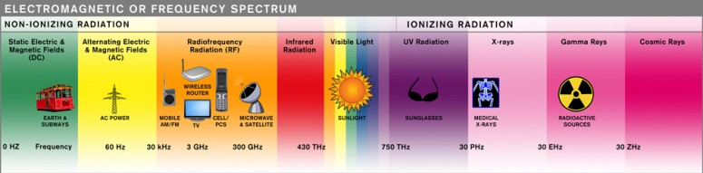

# Networking: Wireless
_COSC 208, Introduction to Computer Systems, 2021-12-08_

## Announcements
* Attend faculty candidate research talks
    * 11:20am Wed, Dec 15
    * Earn 2 points of extra credit on final exam for each talk you attend (earnings capped at 4 points)

## Outline
* Warm-up
* Wireless encoding
* Frequency spectrum
* Medium access control

## Warm-up
* Q1: _You discover two different devices connected to the same network use the IP addresses `128.105.2.44` and `128.105.2.88.` What is the network portion of these IP addresses?_
* Q2: _You discover a third device connected to the same network uses the IP address `128.105.6.60`. Does this change your answer to the preceding question? If so, what is your new answer?_

## Wireless encoding
* Transmit bits of information using electromagnetic waves traveling through air (or free space)
    * Electromagnetic waves form when an electric signal (i.e., vibrating electrons) travels through an antenna
    * When the waves reach another antenna, they cause the electrons in the antenna to vibrate and form an electric signal
* _What three characteristics define an electromagnetic wave?_
    * Frequency — speed of the wave
        * Measured in hertz (Hz) — number of waves per second
        * Depends on the wave length
    * Amplitude — energy of the wave
        * Essentially the height of the wave
    * Phase — position on the wave where the wave cycle starts
* A constant electric signal (theoretically) results in a wave with constant frequency, amplitude, and phase
* To encode bits of information, vary one (or more) of these wave characteristics
    * Frequency shift keying — vary the speed of the wave; high frequency = 1, low frequency = 0
    * Amplitude shift keying — vary the energy of the wave; high amplitude = 1, low amplitude = 0
    * Phase shift keying — vary the starting point of the wave; before trough = 1, before crest = 0
    
    (https://www.5gtechnologyworld.com/digital-modulation-basics-part-1)
* _How could we encode two bits of information at a time?_
    * Use more "levels" — e.g., high frequency = 11, semi-high frequency = 10, semi-low frequency = 01, low frequency = 00
    * Combine two modulation schemes — e.g., high frequency + high amplitude = 11, high frequency + low amplitude = 10, low frequency + high amplitude = 01, low frequency + low amplitude = 00
* Practice: _What is the sequence of bits encoded by each of these wireless signals?_
    * Q3
    
	100100
    * Q4
    
    110010

## Frequency spectrum
* Complete frequency spectrum
    
    (http://www.emfrf.com/electromagnetic-spectrum-or-frequency-spectrum/)
* Radio frequency spectrum
    
    (https://theconversation.com/wireless-spectrum-is-for-sale-but-what-is-it-11794)
* 802.11 wireless frequencies

| 2.4 GHz |  5 GHz  |
|---------|---------|
| Used by many other devices (e.g., microwaves, baby monitors, bluetooth devices) | Used primarily for Wi-Fi |
| Waves can pass through walls fairly easily | Waves cannot pass through walls as well |
| Lower bandwidth — maximum of 600Mbps (with 802.11n) | Higher bandwidth — maximum of 3.4Gbps (with 802.11ac) |
| 3 non-overlapping 20Mhz channels | 23 non-overlapping 20Mhz channels |

## Medium access control
* Carrier Sense Multiple Access with Collision Avoidance (CSMA/CA)
    * _Multiple Access_: wireless spectrum is shared
    * _Carrier Sense_: listen and wait until no other device is transmitting
    * _with Collision Avoidance_: if another device is transmitting, then wait a random amount of time (e.g., a few seconds) before employing carrier sense
* Ready to send / Clear to send (RTS/CTS)
    * _Ready to send_: a device indicates its desire to transmit
    * _Clear to send_: a device can transmit