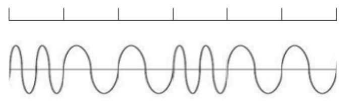
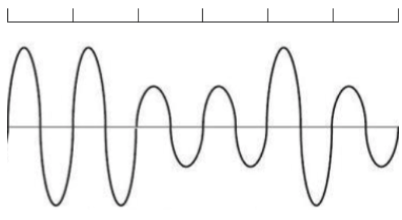
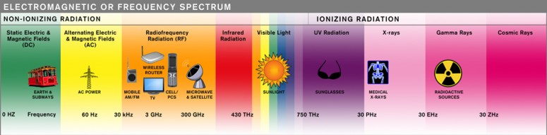
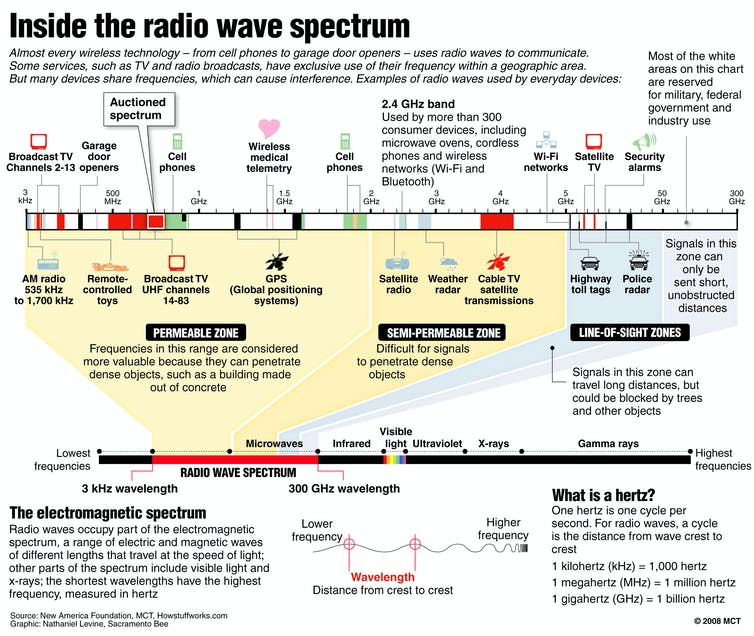

## Warm-up
Q1: _You discover two different devices connected to the same network use the IP addresses `128.105.2.44` and `128.105.2.88.` What is the network portion of these IP addresses?_

Q2: _You discover a third device connected to the same network uses the IP address `128.105.6.60`. Does this change your answer to the preceding question? If so, what is your new answer?_

## Wireless encoding

## Frequency spectrum

(http://www.emfrf.com/electromagnetic-spectrum-or-frequency-spectrum/)

## Frequency spectrum

(https://theconversation.com/wireless-spectrum-is-for-sale-but-what-is-it-11794)

