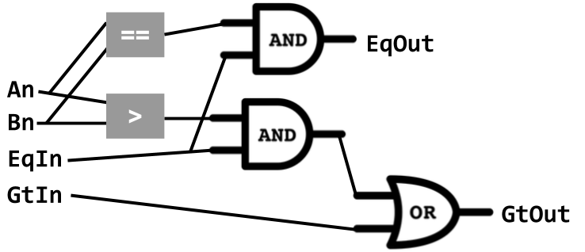

# Architecture: circuits 
_COSC 208, Introduction to Computer Systems, 2022-10-05_

## Announcements
* Programming project 2 due tomorrow @ 11pm

## Outline
* Warm-up: logic gates
* Hardware building blocks
* 1-bit circuits
* n-bit circuits

## Warm-up: logic gates
Q1: _Fill-in the truth tables for all six types of gates_

| A | B | A AND B | A OR B | NOT A | A NAND B | A NOR B | A XOR B |
| - | - | ------- | ------ | ----- | -------- | ------- | ------- |
| 0 | 0 |    0    |   0    |   1   |     1    |    1    |    0    | 
| 0 | 1 |    0    |   1    |   1   |     1    |    0    |    1    | 
| 1 | 0 |    0    |   1    |   0   |     1    |    0    |    1    | 
| 1 | 1 |    1    |   1    |   0   |     0    |    0    |    0    | 

## Hardware building blocks
* Transistors — switches that control electrical flow; output state depends on current state plus input state
* Logic gates — created from transistors; implement boolean operations (AND, NO, NOT, etc.)
* Circuit — created from logic gates
* Processing, control, and units — created from circuits

## Building logic gates
* A chip is easier to build if it contains fewer types of gates
* Q2: _How do you use AND and NOT gates to create a NAND gate?_

    

* Q3: _How do you use OR and NOT gates to create a NOR gate?_

    

## 1-bit circuits
Q4: _Fill-in the truth tables for the following logical operations_

| A | B | (A != B) | (A > B) | (A >= B) |
| - | - | -------- | ------- | -------- |
| 0 | 0 |    0     |    0    |    1     |
| 0 | 1 |    1     |    0    |    0     |
| 1 | 0 |    1     |    1    |    1     |
| 1 | 1 |    0     |    0    |    1     |


### Steps
* _Design the truth table: e.g., A != B_

| A | B | A != B |
| - | - | ------ |
| 0 | 0 |   0    |
| 0 | 1 |   1    |
| 1 | 0 |   1    |
| 1 | 1 |   0    |

* For each row where the output value is 1:
    * Determine how to make each input 1 — e.g., either `A` or `NOT(A)`
    * Conjunct the two subexpressions — e.g., `NOT(A) AND B`
* Create the disjunction of the expressions for each row — e.g., `(NOT(A) AND B) OR (A AND NOT(B))`
* Create a circuit from left to right, starting with the inner-most subexpressions

    

* _Can we build a circuit that uses fewer gates?_
    * `A XOR B`
    * `(A OR B) AND (NOT (A AND B))`

        

### Practice
Q5: _Create a circuit for `A > B` using `AND`, `OR`, `NOT` gates_

`A AND NOT(B)`


Q6: _Create a circuit for `A >= B` using `AND`, `OR`, `NOT` gates_

`(NOT(A) AND NOT(B)) OR (A AND NOT(B)) OR (A AND B)`


* Alternatives
    * `(NOT(A OR B)) OR (A AND NOT(B)) OR (A AND B)`
    * `(NOT(A) AND NOT(B)) OR A`
    * `(NOT(A OR B)) OR A`
    * `NOT(NOT(A) AND B)`
    * `A OR NOT(B)`

Q7: _Your goal is to create a 1-bit circuit to perform addition. The circuit will take 3 input bits (`A`, `B`, and `carry_in`) and produce 2 output bits (`sum` and `carry_out`)._

Q7a: _Complete the truth table for this operation_

| `A` | `B` | `carry_in` | `sum` | `carry_out` |
|-----|-----|------------|-------|-------------|
|  0  |  0  |     0      |   0   |      0      |
|  0  |  0  |     1      |   1   |      0      |
|  0  |  1  |     0      |   1   |      0      |
|  0  |  1  |     1      |   0   |      1      |
|  1  |  0  |     0      |   1   |      0      |
|  1  |  0  |     1      |   0   |      1      |
|  1  |  1  |     0      |   0   |      1      |
|  1  |  1  |     1      |   1   |      1      |

Q7b: _What is the boolean expression for `sum`?_

```
(NOT(A) AND NOT(B) AND carry_in)
OR (NOT(A) AND B AND NOT(carry_in))
OR (A AND NOT(B) AND NOT(carry_in))
OR (A AND B AND carry_in) 
```

Q7c: _Draw the circuit for `sum`_

Q7d: _What is the boolean expression for `carry_out`?_

```
(NOT(A) AND B AND carry_in)
OR (A AND NOT(B) AND carry_in)
OR (A AND B AND NOT(carry_in))
OR (A AND B AND carry_in)
```

Q7e: _Draw the circuit for `carry_out`_


## N-bit circuits
* Q8: _Fill-in the truth-table for `A > B` when A and B are two bits_

| A1 A2 | B1 B2 | A > B |
| ----- | ----- | ----- |
| 0   0 | 0   0 |   0   |
| 0   1 | 0   0 |   1   |
| 1   0 | 0   0 |   1   |
| 1   1 | 0   0 |   1   |
| 0   0 | 0   1 |   0   |
| 0   1 | 0   1 |   0   |
| 1   0 | 0   1 |   1   |
| 1   1 | 0   1 |   1   |
| 0   0 | 1   0 |   0   |
| 0   1 | 1   0 |   0   |
| 1   0 | 1   0 |   0   |
| 1   1 | 1   0 |   1   |
| 0   0 | 1   1 |   0   |
| 0   1 | 1   1 |   0   |
| 1   0 | 1   1 |   0   |
| 1   1 | 1   1 |   0   |

* _How did you determine this?_
    * Convert to decimal — not an option for hardware
    * Compare 1st bits, then, if necessary, compare 2nd bits — `(A1 > B1) OR ((A1 == B1) AND (A2 > B2))`
* _What if there were 3 bits?_ — compare 1st bits, then, if necessary, 2nd bits, then, if necessary, 3rd bits; `(A1 > B1) OR ((A1 == B1) AND (A2 > B2)) OR ((A1 == B1) AND (A2 == B2) AND (A3 > B3))`
* _What do you need to know about previous bits?_
    * Is some previous bit greater?
    * Are all previous bits equal?
* N-bit greater-than circuit
    * Inputs
        * `An`
        * `Bn`
        * `GtIn`
        * `EqIn`
    * Outputs — _What are the formulas for these?_
        * `GtOut`: `GtIn OR (EqIn AND (An > Bn))`
        * `EqOut`: `EqIn AND (An == Bn)`

    

## Extra practice
* Q9: _How do you use NAND gates to create a NOT gate?_

    

* Q10: _How do you use NAND gates to create an AND gate?_

    