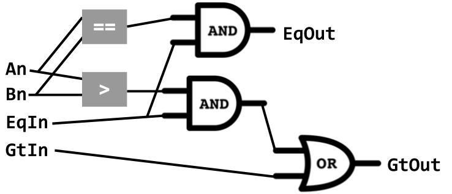

# Architecture: circuits (continued)
_COSC 208, Introduction to Computer Systems, 2022-10-07_

## Announcements
* Programming project 3 due Thursday, October 20 @ 11pm

## Outline
* Warm-up
* Arithmetic circuits
* n-bit circuits
* Multiplexer circuit
* Arithmetic Logic Unit (ALU)

## Warm-up
Q1: _Create a 1-bit circuit for `A <= B` using `AND`, `OR`, `NOT` gates_

| A | B | A <= B |
| - | - | ------ |
| 0 | 0 |   1    |
| 0 | 1 |   1    |
| 1 | 0 |   0    |
| 1 | 1 |   1    |

```
((NOT A) AND (NOT B)) OR
((NOT A) AND B) OR
(A AND B)
```

## Arithmetic circuits
Q2: _Your goal is to create a 1-bit circuit to perform addition. The circuit will take 3 input bits (`A`, `B`, and `carry_in`) and produce 2 output bits (`sum` and `carry_out`)._

Q2a: _Truth table for this operation_

| `A` | `B` | `carry_in` | `sum` | `carry_out` |
|-----|-----|------------|-------|-------------|
|  0  |  0  |     0      |   0   |      0      |
|  0  |  0  |     1      |   1   |      0      |
|  0  |  1  |     0      |   1   |      0      |
|  0  |  1  |     1      |   0   |      1      |
|  1  |  0  |     0      |   1   |      0      |
|  1  |  0  |     1      |   0   |      1      |
|  1  |  1  |     0      |   0   |      1      |
|  1  |  1  |     1      |   1   |      1      |

Q2b: _What is the boolean expression for `sum`?_

```
(NOT(A) AND NOT(B) AND carry_in)
OR (NOT(A) AND B AND NOT(carry_in))
OR (A AND NOT(B) AND NOT(carry_in))
OR (A AND B AND carry_in) 
```

Q2c: _Draw the circuit for `sum`_

Q2d: _What is the boolean expression for `carry_out`?_

```
(NOT(A) AND B AND carry_in)
OR (A AND NOT(B) AND carry_in)
OR (A AND B AND NOT(carry_in))
OR (A AND B AND carry_in)
```

Q2e: _Draw the circuit for `carry_out`_


## N-bit circuits
* Q3: _Fill-in the truth-table for `A > B` when A and B are two bits_

| A1 A2 | B1 B2 | A > B |
| ----- | ----- | ----- |
| 0   0 | 0   0 |   0   |
| 0   1 | 0   0 |   1   |
| 1   0 | 0   0 |   1   |
| 1   1 | 0   0 |   1   |
| 0   0 | 0   1 |   0   |
| 0   1 | 0   1 |   0   |
| 1   0 | 0   1 |   1   |
| 1   1 | 0   1 |   1   |
| 0   0 | 1   0 |   0   |
| 0   1 | 1   0 |   0   |
| 1   0 | 1   0 |   0   |
| 1   1 | 1   0 |   1   |
| 0   0 | 1   1 |   0   |
| 0   1 | 1   1 |   0   |
| 1   0 | 1   1 |   0   |
| 1   1 | 1   1 |   0   |

* _How did you determine this?_
    * Convert to decimal — not an option for hardware
    * Compare 1st bits, then, if necessary, compare 2nd bits — `(A1 > B1) OR ((A1 == B1) AND (A2 > B2))`
* _What if there were 3 bits?_ — compare 1st bits, then, if necessary, 2nd bits, then, if necessary, 3rd bits; `(A1 > B1) OR ((A1 == B1) AND (A2 > B2)) OR ((A1 == B1) AND (A2 == B2) AND (A3 > B3))`
* _What do you need to know about previous bits?_
    * Is some previous bit greater?
    * Are all previous bits equal?
* N-bit greater-than circuit
    * Inputs
        * `An`
        * `Bn`
        * `GtIn`
        * `EqIn`
    * Outputs — _What are the formulas for these?_
        * `GtOut`: `GtIn OR (EqIn AND (An > Bn))`
        * `EqOut`: `EqIn AND (An == Bn)`

    

## Multiplexer circuit
* Semantics
    ```
    select == 1 ==> output A's value
    select == 0 ==> output B's value
    ```
* Truth-table

| `select` | `A` | `B` | `out` |
|----------|-----|-----|-------|
|     0    |  0  |  0  |   0   |
|     0    |  0  |  1  |   1   |
|     0    |  1  |  0  |   0   |
|     0    |  1  |  1  |   1   |
|     1    |  0  |  0  |   0   |
|     1    |  0  |  1  |   0   |
|     1    |  1  |  0  |   1   |
|     1    |  1  |  1  |   1   |

* Logical formula
    ```
    (NOT(select) AND NOT(A) AND (B)) OR
    (NOT(select) AND (A) AND NOT(B)) OR
    (select AND NOT(A) AND (B)) OR
    (select AND (A) AND NOT(B)) OR
    ```
* Simplified logical formula
    ```
    (NOT(select) AND (B)) OR (select AND (A))
    ```
* Circuit
    


## Arithmetic Logic Unit (ALU)


