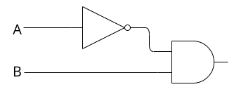
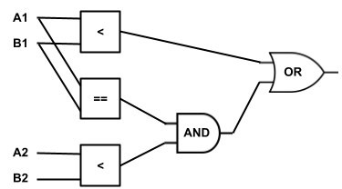
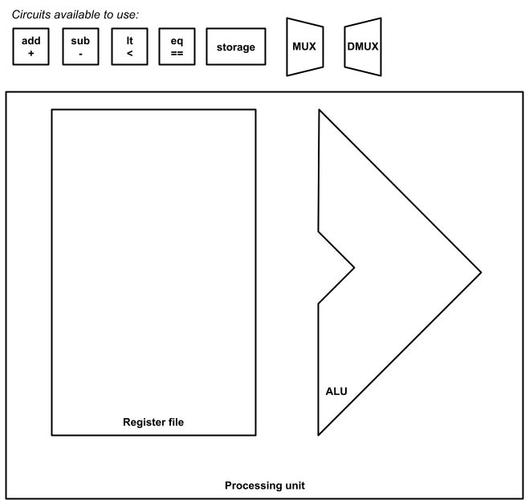

# Exam 2 Review
_COSC 208, Introduction to Computer Systems, 2022-10-26_

## Announcements
* Exam 2
    * Study guide posted on Moodle
    * Take-home portion: released Wednesday after class; due Friday before class
    * In-class portion: Friday during class
* Pre-register for COSC courses for spring semester by Friday at 5pm

## Outline
* Trace assembly code with function calls
* Exam 2 review

## No warm-up — happy Wednesday!

## Dynamic memory allocation
Q1: _The function below allocates several regions of memory on the heap. Draw a diagram that depicts the contents of the stack and heap at the end of main. Label each memory region with its size in bytes.)_
```C
#include <stdlib.h>
int main() {
    char **alpha = malloc(sizeof(char *) * 4);
    char **beta = alpha;
    for (int i = 1; i < 4; i++) {
        alpha[i] = malloc(sizeof(char) * i);
        *alpha[i] = i + 'a';
        *beta = alpha[i];
        beta++;
    }
}  
```
```
Stack                         Heap

alpha (8B)                    (4 * 8B = 32B) 
┌────────┐                    ┌────────┬────────┬────────┬────────┐
│   ~~~~~~~~~~~~~~~~~~~~~~~~~>│   |    │   |    │   |    │   |    │
└────────┘                    └───|────┴───|────┴───|────┴───|────┘
                                  |        |        |╭~~~~~~~╯  ^
                                  V        V        VV          |
                                  ┌─┐      ┌─┬─┐    ┌─┬─┬─┐     |
                                  │b│      │c│ │    │d│ │ │     |
                                  └─┘      └─┴─┘    └─┴─┴─┘     |
beta (8B)                         (1B)     (2B)     (3B)        |
┌────────┐                                                      |                        
│   ~~~~~~~~~~~~~~~~~~~~~~~~~~~~~~~~~~~~~~~~~~~~~~~~~~~~~~~~~~~~╯
└────────┘

i (4B)
┌────┐                        
│ 4  │ 
└────┘
```

<div style="page-break-after:always;"></div>

## Data structures using dynamic memory allocation
Q2: _The following code provides a function to add an integer value to the end of a queue:_
```C
#include <stdlib.h>
struct item {
    int value;
    struct item *next;
}   
struct item *enqueue(struct item *head, int value) {
    // Allocate new item and populate
    struct item *new = malloc(sizeof(struct item));
    new->value = value;
    new->next = NULL;

    // Item becomes new head if queue is empty
    if (NULL == head) {
        return next;
    }
    
    // Item goes at the end of the queue
    while (head->next != NULL) {
        head = head->next;
    }
    head->next = new;
    return new;
}  
```

_Write a corresponding `dequeue` function that removes the head of the queue, stores its value in the memory location pointed to by the `result` argument, and returns the new head (which may be `NULL`). If the queue is empty, return `NULL` and leave the contents of result untouched. Your function should be written such that there are no memory leaks._

```C
struct item *dequeue(struct item *head, int *result) {
    // Do nothing if queue is empty
    if (NULL == head) {
        return NULL;
    }

    *result = head->value;
    struct item *new_head = head->next;
    free(head);
    return new_head;
}
```

<div style="page-break-after:always;"></div>

## Circuits
Q3: _Draw a 1-bit circuit for `A < B` using only `AND`, `OR`, and `NOT` gates. Show your work (i.e., any intermediate design steps you took)._

| A | B | A < B |
| - | - | ----- |
| 0 | 0 |   0   |
| 0 | 1 |   1   |
| 1 | 0 |   0   |
| 1 | 1 |   0   |

```
NOT(A) AND B
```




Q4: _Assume you have access to 1-bit circuits for `A < B`, `A == B`, and `A > B` and logic gates for `AND`, `OR`, and `NOT`. Draw a 2-bit circuit for `A < B` which uses the existing circuits and logic gates. Assume `A1` and `B1` are the most significant bits, and `A2` and `B2` are the least significant bits._

| A1 A2 | B1 B2 | A < B |
| ----- | ----- | ----- |
| 0   0 | 0   0 |   0   |
| 0   1 | 0   0 |   0   |
| 1   0 | 0   0 |   0   |
| 1   1 | 0   0 |   0   |
| 0   0 | 0   1 |   1   |
| 0   1 | 0   1 |   0   |
| 1   0 | 0   1 |   0   |
| 1   1 | 0   1 |   0   |
| 0   0 | 1   0 |   1   |
| 0   1 | 1   0 |   1   |
| 1   0 | 1   0 |   0   |
| 1   1 | 1   0 |   0   |
| 0   0 | 1   1 |   1   |
| 0   1 | 1   1 |   1   |
| 1   0 | 1   1 |   1   |
| 1   1 | 1   1 |   0   |



<div style="page-break-after:always;"></div>

Q5: _Use the available circuits to create a processing unit with four registers and four operations (`+`, `-`, `<`, and `==`)._



<div style="page-break-after:always;"></div>


## Assembly
### C code
```C
1   int interest_due(int outstanding, int rate) {
2       int divisor = 1200;
3       int annual = outstanding * rate;
4       int monthly = annual / divisor;
5       return monthly;
6   }
7
8   int make_payment(int outstanding, int payment, int rate) {
9       int interest = interest_due(outstanding, rate);
10      int principal = payment - interest;
11      if (principal > outstanding) {
12          outstanding = 0;
13      } else {
14          outstanding -= principal;    
15      }
16      return outstanding;
17  }
18
19  int months_remain(int outstanding, int payment, int rate) {
20      int months = 0;
21      while (outstanding > 0) {
22          months++;
23          outstanding = make_payment(outstanding, payment, rate);
24      }
25      return months;
26  }
27
28  int main() {
29      int outstanding = 0, payment = 0, rate = 0;
30      printf("Outstanding principal: $");
31      scanf("%d", &outstanding);
32      printf("Monthly payment: $");
33      scanf("%d", &payment);
34      printf("Interest rate: ");
35      scanf("%d", &rate);
36      int remain = months_remain(outstanding, payment, rate);
37      printf("Your loan will be paid off in %d months\n", remain);
38  }
```

<div style="page-break-after:always;"></div>

### Assembly code
```
00000000004005d4 <interest_due>:
  4005d4:    d10083ff     sub    sp, sp, #0x20
  4005d8:    b9001fe0     str    w0, [sp, #28]
  4005dc:    b9001be1     str    w1, [sp, #24]
  4005e0:    52809608     mov    w8, #0x4b0
  4005e4:    b90017e8     str    w8, [sp, #20]
  4005e8:    b9401fe8     ldr    w8, [sp, #28]
  4005ec:    b9401be9     ldr    w9, [sp, #24]
  4005f0:    1b097d08     mul    w8, w8, w9
  4005f4:    b90013e8     str    w8, [sp, #16]
  4005f8:    b94013e8     ldr    w8, [sp, #16]
  4005fc:    b94017e9     ldr    w9, [sp, #20]
  400600:    1ac90d08     sdiv   w8, w8, w9
  400604:    b9000fe8     str    w8, [sp, #12]
  400608:    b9400fe0     ldr    w0, [sp, #12]
  40060c:    910083ff     add    sp, sp, #0x20
  400610:    d65f03c0     ret    

0000000000400614 <make_payment>:
  400614:    d100c3ff     sub    sp, sp, #0x30
  400618:    f90013fe     str    x30, [sp, #32]
  40061c:    b9001fe0     str    w0, [sp, #28]
  400620:    b9001be1     str    w1, [sp, #24]
  400624:    b90017e2     str    w2, [sp, #20]
  400628:    b9401fe0     ldr    w0, [sp, #28]
  40062c:    b94017e1     ldr    w1, [sp, #20]
  400630:    97ffffe9     bl     4005d4 <interest_due>
  400634:    b90013e0     str    w0, [sp, #16]
  400638:    b9401be8     ldr    w8, [sp, #24]
  40063c:    b94013e9     ldr    w9, [sp, #16]
  400640:    6b090108     subs   w8, w8, w9
  400644:    b9000fe8     str    w8, [sp, #12]
  400648:    b9400fe8     ldr    w8, [sp, #12]
  40064c:    b9401fe9     ldr    w9, [sp, #28]
  400650:    6b09011f     cmp    w8, w9
  400654:    5400006d     b.le   400660 <make_payment+0x4c>
  400658:    b9001fff     str    wzr, [sp, #28]
  40065c:    14000005     b      400670 <make_payment+0x5c>
  400660:    b9400fe8     ldr    w8, [sp, #12]
  400664:    b9401fe9     ldr    w9, [sp, #28]
  400668:    6b080128     subs   w8, w9, w8
  40066c:    b9001fe8     str    w8, [sp, #28]
  400670:    b9401fe0     ldr    w0, [sp, #28]
  400674:    f94013fe     ldr    x30, [sp, #32]
  400678:    9100c3ff     add    sp, sp, #0x30
  40067c:    d65f03c0     ret    
```

<div style="page-break-after:always;"></div>

```
0000000000400680 <months_remain>:
  400680:    d10083ff     sub    sp, sp, #0x20
  400684:    f9000bfe     str    x30, [sp, #16]
  400688:    b9000fe0     str    w0, [sp, #12]
  40068c:    b9000be1     str    w1, [sp, #8]
  400690:    b90007e2     str    w2, [sp, #4]
  400694:    b90003ff     str    wzr, [sp]
  400698:    b9400fe8     ldr    w8, [sp, #12]
  40069c:    7100011f     cmp    w8, #0x0
  4006a0:    37000148     b.le   4006c8 <months_remain+0x4c>
  4006a4:    b94003e8     ldr    w8, [sp]
  4006a8:    11000508     add    w8, w8, #0x1
  4006ac:    b90003e8     str    w8, [sp]
  4006b0:    b9400fe0     ldr    w0, [sp, #12]
  4006b4:    b9400be1     ldr    w1, [sp, #8]
  4006b8:    b94007e2     ldr    w2, [sp, #4]
  4006bc:    97ffffd5     bl     400614 <make_payment>
  4006c0:    b9000fe0     str    w0, [sp, #12]
  4006c4:    17fffff4     b      400698 <months_remain+0x18>
  4006c8:    b94003e0     ldr    w0, [sp]
  4006cc:    f9400bfe     ldr    x30, [sp, #16]
  4006d0:    910083ff     add    sp, sp, #0x20
  4006d4:    d65f03c0     ret    
```

<div style="page-break-after:always;"></div>

### Mapping assembly code to C source code
Q6: _For each line of assembly code, indicate which line of C code was used to generate that line of assembly code._
```
00000000004005d4 <interest_due>:
  4005d4:    d10083ff     sub    sp, sp, #0x20   // 1
  4005d8:    b9001fe0     str    w0, [sp, #28]   // 1
  4005dc:    b9001be1     str    w1, [sp, #24]   // 1
  4005e0:    52809608     mov    w8, #0x4b0      // 2
  4005e4:    b90017e8     str    w8, [sp, #20]   // 2
  4005e8:    b9401fe8     ldr    w8, [sp, #28]   // 3
  4005ec:    b9401be9     ldr    w9, [sp, #24]   // 3
  4005f0:    1b097d08     mul    w8, w8, w9      // 3
  4005f4:    b90013e8     str    w8, [sp, #16]   // 3
  4005f8:    b94013e8     ldr    w8, [sp, #16]   // 4
  4005fc:    b94017e9     ldr    w9, [sp, #20]   // 4
  400600:    1ac90d08     sdiv   w8, w8, w9      // 4
  400604:    b9000fe8     str    w8, [sp, #12]   // 4
  400608:    b9400fe0     ldr    w0, [sp, #12]   // 5
  40060c:    910083ff     add    sp, sp, #0x20   // 5
  400610:    d65f03c0     ret                    // 5
```

Q7: _For each line of assembly code, indicate which line of C code was used to generate that line of assembly code._
```
0000000000400614 <make_payment>:
  400614:    d100c3ff     sub    sp, sp, #0x30   // 8
  400618:    f90013fe     str    x30, [sp, #32]  // 8
  40061c:    b9001fe0     str    w0, [sp, #28]   // 8
  400620:    b9001be1     str    w1, [sp, #24]   // 8
  400624:    b90017e2     str    w2, [sp, #20]   // 8
  400628:    b9401fe0     ldr    w0, [sp, #28]   // 9
  40062c:    b94017e1     ldr    w1, [sp, #20]   // 9
  400630:    97ffffe9     bl     4005d4 <interest_due> // 9
  400634:    b90013e0     str    w0, [sp, #16]   // 9
  400638:    b9401be8     ldr    w8, [sp, #24]   // 10
  40063c:    b94013e9     ldr    w9, [sp, #16]   // 10
  400640:    6b090108     subs   w8, w8, w9      // 10
  400644:    b9000fe8     str    w8, [sp, #12]   // 10
  400648:    b9400fe8     ldr    w8, [sp, #12]   // 11
  40064c:    b9401fe9     ldr    w9, [sp, #28]   // 11
  400650:    6b09011f     cmp    w8, w9          // 11
  400654:    5400006d     b.le   400660 <make_payment+0x4c>  // 11
  400658:    b9001fff     str    wzr, [sp, #28]  // 12
  40065c:    14000005     b      400670 <make_payment+0x5c>  // 13
  400660:    b9400fe8     ldr    w8, [sp, #12]   // 14
  400664:    b9401fe9     ldr    w9, [sp, #28]   // 14
  400668:    6b080128     subs   w8, w9, w8      // 14
  40066c:    b9001fe8     str    w8, [sp, #28]   // 14
  400670:    b9401fe0     ldr    w0, [sp, #28]   // 16
  400674:    f94013fe     ldr    x30, [sp, #32]  // 16
  400678:    9100c3ff     add    sp, sp, #0x30   // 16
  40067c:    d65f03c0     ret                    // 16
```

<div style="page-break-after:always;"></div>

## Translating assembly into low-level C code
Q8: _For each of the following lines of assembly, write one or more lines of low-level C code that express the semantics (i.e., meaning) of the assembly code. Your C code should use register names as variable names._
```
0000000000400614 <make_payment>:
  400614:    d100c3ff     sub    sp, sp, #0x30   // sp = sp - 0x30
  400618:    f90013fe     str    x30, [sp, #32]  // *(sp + 32) = x30
  40061c:    b9001fe0     str    w0, [sp, #28]   // *(sp + 28) = w0
  400620:    b9001be1     str    w1, [sp, #24]   // *(sp + 24) = w1
  400624:    b90017e2     str    w2, [sp, #20]   // *(sp + 20) = w2
  400628:    b9401fe0     ldr    w0, [sp, #28]   // w0 = *(sp + 28)
  40062c:    b94017e1     ldr    w1, [sp, #20]   // w1 = *(sp + 20)
  400630:    97ffffe9     bl     4005d4 <interest_due> // x30 = pc (0x634); pc = 0x5d4
  400634:    b90013e0     str    w0, [sp, #16]   // *(sp + 16) = w0
  400638:    b9401be8     ldr    w8, [sp, #24]   // w8 = *(sp + 24)
  40063c:    b94013e9     ldr    w9, [sp, #16]   // w8 = *(sp + 16)
  400640:    6b090108     subs    w8, w8, w9    // w8 = w8 - w9
  400644:    b9000fe8     str    w8, [sp, #12]   // *(sp + 12) = w8
  400648:    b9400fe8     ldr    w8, [sp, #12]   // w8 = *(sp + 12)
  40064c:    b9401fe9     ldr    w9, [sp, #28]   // w9 = *(sp + 28)
  400650:    6b09011f     cmp    w8, w9          // if (w8 <= w9)
  400654:    5400006d     b.le   400660 <make_payment+0x4c>  // pc = 0x660
  400658:    b9001fff     str    wzr, [sp, #28]  // *(sp + 28) = 0
  40065c:    14000005     b      400670 <make_payment+0x5c>  // pc = 0x670
  400660:    b9400fe8     ldr    w8, [sp, #12]   // w8 = *(sp + 12)
  400664:    b9401fe9     ldr    w9, [sp, #28]   // w9 = *(sp + 28)
  400668:    6b080128     subs   w8, w9, w8      // w8 = w9 - w8
  40066c:    b9001fe8     str    w8, [sp, #28]   // *(sp + 28) = w8
  400670:    b9401fe0     ldr    w0, [sp, #28]   // w0 = *(sp + 28)
  400674:    f94013fe     ldr    x30, [sp, #32]  // x30 = *(sp + 32)
  400678:    9100c3ff     add    sp, sp, #0x30   // sp = sp + 0x30
  40067c:    d65f03c0     ret                    // pc = x30
```

<div style="page-break-after:always;"></div>

### Transforming C code to use goto
Q9: _Create a `make_payment_goto` function that behaves the same as the `make_payment` function but uses `goto` statements, just as a compiler would do when generating assembly code._
```C
void make_payment_goto(int outstanding, int payment, int rate) {
  int interest = interest_due(outstanding, rate);
  int principal = payment - interest);
  if (principal <= outstanding)
    goto ELSE;
  outstanding = 0;
  goto END;
ELSE:
  outstanding == principal;
END:
  return outstanding;
}
```

Q10: _Create a `months_remain_goto` function that behaves the same as the `months_remain` function but uses `goto` statements, just as a compiler would do when generating assembly code._
```C
int months_remain_goto(int outstanding, int pyament, int rate) {
  int months = 0;
LOOP:
  if (oustanding <= 0)
    goto END;
  months++;
  oustanding = make_payment(&outstanding, payment, rate);
  goto LOOP;
END:
  return months;
}
```

<div style="page-break-after:always;"></div>

### Tracing assembly code
Q11: _Assume the code starts executing at the beginning of the `make_payment` function (i.e., `pc = 0x400614)`. Draw a digram that shows the contents of the stack and registers immediately before executing the `ret` instruction in the `interest_due` function (i.e., before executing the assembly instruction at address `0x400610`). Your stack and registers should contain values (e.g., `0x400614`) *not* variable or register names._

_Assume the initial values of the registers are as follows:_
* `pc = 0x4006c0`
* `sp = 0xf80`
* `w0 = 100000`
* `w1 = 500`
* `w2 = 3`
* `x30 = 0x96c`

Final register values:
* `pc = 0x400610`
* `sp = 0xF50`
* `w/x0 = 250`
* `w/x1 = 3`
* `w/x2 = 3`
* `w/x8 = 250`
* `w/x9 = 0x4B0`
* `x30 = 0x400634`

Final stack:
```
      ┌─────────────────┐   ──╮
0xF30 │                 │     │
      ├────────┬────────┤     │
0xF38 │        │  250   │     │
      ├────────┼────────┤     │ months_remain
0xF40 │ 300000 │  0x4B0 │     │
      ├────────┼────────┤     │
0xF48 │   3    │ 100000 │     │
sp ─> ├────────┴────────┤   ──┤
0xF50 │                 │     │
      ├─────────────────┤     │
0xF58 │                 │     │
      ├────────┬────────┤     │
0xF60 │        │   3    │     │
      ├────────┼────────┤     │ make_payment
0xF68 │   500  │ 100000 │     │
      ├────────┴────────┤     │
0xF70 │      0x96C      │     │
      ├─────────────────┤     │
0xF78 │                 │     │
      ├─────────────────┤   ──╯
0xF80 │                 │
      └─────────────────┘
```