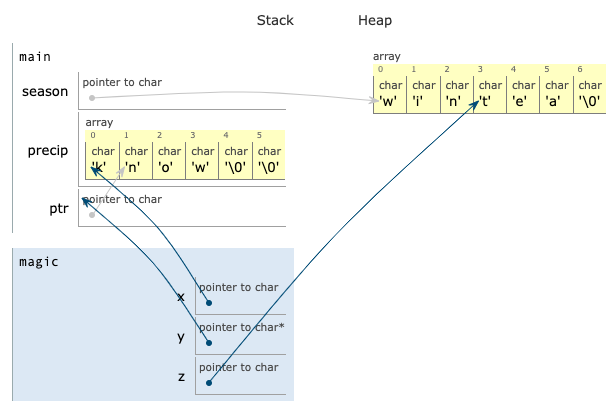

# Virtualization: cloud computing; Exam 4 (Final) Review
_COSC 208, Introduction to Computer Systems, 2022-12-09_

## Announcements
* Attend faculty candidate talks Dec 12 (11am), 13 (11:30am), 14 (11:30am), & 15 (time TBA)
    * Earn 2 points of extra credit on final exam for each talk attended (maximum of 4 points)
* Final exam
    * **Additional office hours today 12pm-2pm**
    * Study guide posted on Moodle
    * Take-home portion: due Monday
    * In-class portion: Monday 9am-11am or 12pm-2pm
    * **Return your RPi during the in-class portion**

## Outline
* Cloud computing
* Virtual machines and containers
* Threads
* Number representation
* Pointers & dynamic memory allocation
* Memory errors

## No warm-up — Happy last day of the semester!

## Cloud computing
* Characteristics
    * Resources available on-demand — tenants reserve resources only when they need them
        * E.g., a company uses more virtual machines during the day when employees are using applications
        * E.g., a website has more visitors during a sale or popular event
    * Pay-per-use — only pay for the resources you use
        * E.g., pay for a virtual machine per hour of use
        * E.g., pay for storage per GB per month
    * Shared & virtualized — physical servers and storage devices resources are used by multiple tenants
        * E.g., multiple virtual machines run on the same machine
        * Physical servers and storage are usually more isolated than network switches and links
* Service models
    * Infrastructure-as-a-Service (IaaS)
        * Tenants lease virtual machines, virtual storage, and virtual networks
        * Tenants must manage the operating system, file system, etc.
        * E.g., Amazon EC2, Microsoft Azure, Rackspace, Google Compute Engine
    * Platform-as-a-Service (PaaS)
        * Tenants lease resources to run applications written in a specific language — Python, Java, Hadoop/MapReduce
        * Cloud provider manages the operating system, file system, and network
        * E.g., Google App Engine, Cloud Foundry, IBM Cloud
    * Function-as-a-Service (FaaS) or serverless
        * Tenants run independent snippets of code
        * E.g., Amazon Lambda
    * Software-as-a-Service (SaaS)
        * Tenants lease access to specific software
        * E.g., Salesforce, Concur, Constant Contact, Google Drive, Office 365
    * Storage-as-a-Service (STaaS)
        * E.g., Dropbox, Google Drive, iCloud
    * Ownership
        * Public - anyone can request and use resources
        * Private - resources are only available to tenants (e.g., departments) within a company or organization
        * Hybrid - tenants use a combination of public and private cloud resources
    * Q1: _For each of the following service providers, indicate what type of service they offer._
        * _Box provides secure file sharing and storage_ — Storage-as-a-Service (STaaS)
        * _Microsoft Azure provides virtual machines running Windows or Linux_ — Infrastructure-as-a-Service (IaaS)
        * _Heroku allows tenants to deploy code written in Ruby, Java, PHP, Python, Go, Scala, or Clojure_ — Platform-as-a-Service (PaaS)
        * _Oracle Supply Chain Management (SCM) is software that allows businesses to manage their supply chain_ — Software-as-a-Service (SaaS)

## Virtual machines and containers
* Q2: _What is an advantage of using **virtual machines with a type 1 hypervisor** instead of **virtual machines with a type 2 hypervisor**?_
* Q3: _What is an advantage of using **virtual machines with a type 2 hypervisor** instead of **virtual machines with a type 1 hypervisor**?_
* Q4: _What is an advantage of using **containers** instead of **virtual machines with a type 1 hypervisor**?_
* Q5: _What is an advantage of using **virtual machines with a type 1 hypervisor** instead of **containers**?_


## Threads
A program contains the following global variables and functions:
```C
void *dbl(void *arg) {
    int *t = (int *)arg;
    *t = *t * 2;
}

void *inc(void *arg) {
    int *t = (int *)arg;
    *t = *t + 1;
}
```
_For each of the following main methods, list **all possible outputs** the program could produce. Assume threads are only preempted if they become blocked waiting for other threads._

* Q6:
    ```C
    int main() {
        int *total = malloc(sizeof(int));
        *total = 3;
        pthread_t thrA, thrB;
        pthread_create(&thrA, NULL, &dbl, total);
        pthread_create(&thrB, NULL, &inc, total);
        pthread_join(thrA, NULL);
        pthread_join(thrB, NULL);
        printf("%d\n", total);
    }
    ```
    * `7` (if `thrB` runs after `thrA` finishes)
    * `8` (if `thrA` runs after `thrB` finishes)
* Q7:
    ```C
    int main() {
        int *total = malloc(sizeof(int));
        *total = 3
        pthread_t thrA, thrB;
        pthread_create(&thrA, NULL, &inc, total);
        pthread_join(thrA, NULL);
        pthread_create(&thrB, NULL, &dbl, total);
        pthread_join(thrB, NULL);
        printf("%d\n", total);
    }
    ```
    * `8` (`thrA` is joined, i.e., must finish, before `thrB` is created) 

## Number representation
* Q8: _Convert `0b10101010` to an unsigned decimal number_ – `170`
* Q9: _Convert `0b10101010` to an signed decimal number_ – `-86`
* Q10: _Convert `43` to 8-bit two's complement_ – `0b00101011`
* Q11: _Convert `-43` to 8-bit two's complement_ — `0b11010101`
* Q12: _Compute `0b0011 & 0b0101`_ — `0b0001`
* Q13: _Compute `0b0011 | 0b0101`_ — `0b0111`
* Q14: _In a system that represents numbers using 8-bit two's complement will the computation `120 + 16` result in overflow, underflow, or neither?_ - overflow
* Q15: _In a system that represents numbers using 8-bit two's complement will the computation `-120 + -8` result in overflow, underflow, or neither?_ - neither

## Pointers & dynamic memory allocation
Q16: _Assume the following program is executed._
```C
void magic(char *x, char **y) {
    char *z = *y;
    z[2] = 'a';
    *x = 'k';
    *y = &x[1];
    // STOP HERE
}

int main() {
    char *season = malloc(sizeof(char) * 7);
    strcpy(season, "winter");
    char precip[6] = "snow";
    char *ptr = season + 3;
    magic(precip, &ptr);
}
```

_Draw the contents of the stack and heap when the program reaches the comment `STOP HERE`. If a memory region is freed, cross it out; do not erase it from your diagram._



## Memory errors
The intended behavior of the program below is to output a string that contains multiple copies of a word (e.g., `"byebye"`). The code below compiles without warnings, but it contains multiple errors.
```C
1   #include <stdlib.h>
2   #include <string.h>
3   #include <stdio.h>
4   char *repeat(char *word, int count) {
5       char *dup = malloc(sizeof(*word) * count + 1);
6       int k = 0;
7       for (int i = 0; i < count; i++) {
8           for (int j = 0; j <= strlen(word) * count; j++) {
9               dup[k] = word[j];
10              k++;
11          }
12      }
13      free(dup);
14      return dup;
15  }
16  int main() {
17      char *orig = malloc(4);
18      strcpy(orig, "bye");
19      char *result = repeat(orig, 2);
20      printf("%s\n", result);
21  }
```
For each of the following errors produced by valgrind, describe (in 2-3 sentences) **why** the error is occurring and **how** you would modify the code to correct the error.

* Q17:
    ```
    Invalid write of size 1
        at 0x4006CA: repeat (repeat.c:9)
        by 0x400752: main (repeat.c:19)
    Address 0x5204093 is 0 bytes after a block of size 3 alloc'd
        at 0x4C2DB8F: malloc (in /usr/lib/valgrind/vgpreload_memcheck-amd64-linux.so)
        by 0x40066B: repeat (repeat.c:5)
        by 0x400752: main (repeat.c:19)
    ```
    Not enough space was allocated for the duplicated string: `sizeof(*word)` gets the size of a single character. Use `strlen(word)` to get the number of characters in the original word.
* Q18:
    ```
    Invalid read of size 1
        at 0x4006BF: repeat (repeat.c:9)
        by 0x400752: main (repeat.c:19)
    Address 0x5204044 is 0 bytes after a block of size 4 alloc'd
        at 0x4C2DB8F: malloc (in /usr/lib/valgrind/vgpreload_memcheck-amd64-linux.so)
        by 0x400723: main (repeat.c:17)
    ```
    The inner for loop goes beyond the end of the original word. The for loop condition should be `j < strlen(word)`.
* Q19:
    ```
    Invalid read of size 1
        at 0x4E88CD0: vfprintf (vfprintf.c:1632)
        by 0x4E8F8A8: printf (printf.c:33)
        by 0x40076B: main (repeat.c:20)
    Address 0x5204090 is 0 bytes inside a block of size 3 free'd
        at 0x4C2EDEB: free (in /usr/lib/valgrind/vgpreload_memcheck-amd64-linux.so)
        by 0x4006FF: repeat (repeat.c:13)
        by 0x400752: main (repeat.c:19)
    Block was alloc'd at
        at 0x4C2DB8F: malloc (in /usr/lib/valgrind/vgpreload_memcheck-amd64-linux.so)
        by 0x40066B: repeat (repeat.c:5)
        by 0x400752: main (repeat.c:19)
    ```
    The string containing the repeated word is free'd (in `repeat`) before it is printed (in `main`). Move the call to `free` in `repeat` to after the call to `printf` in `main`.
* Q20:
    ```
    4 bytes in 1 blocks are definitely lost in loss record 1 of 1
        at 0x4C2DB8F: malloc (in /usr/lib/valgrind/vgpreload_memcheck-amd64-linux.so)
        by 0x400723: main (repeat.c:17)
    ```
    The space for the original word (allocated in `main`) is not freed. Add `free(orig)` after the call to `repeat` in `main`.

